# 新媒体方向 - 个人/个体户/公司对比分析

**日期**: 2026/5/10  
**适用方向**: 抖音/B站/视频创作/知识付费

---

## 📋 快速总结（3分钟读懂）

### 💡 核心结论

**推荐顺序：个体户 > 个人 > 公司**

| 主体类型 | 最佳适用场景 | 核心优势 | 主要劣势 |
|---------|-------------|---------|---------|
| **个人** | 起步测试期（月入<2万） | 注册即时、操作简单 | 税费高（20-40%）、不能开票 |
| **个体户** | 稳定运营期（月入2-10万） | **税费最低（2.5-17.5%）**、可开票 | 不能开13%专票 |
| **公司** | 规模化发展（月入>10万+特殊需求） | 可开专票、适合融资 | 税费最高（约25%）、记账复杂 |

### 🎯 本质区别可视化

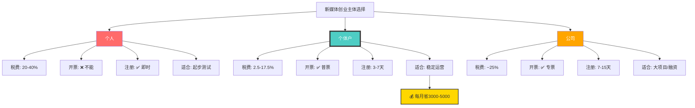

### 📊 多维度评分对比

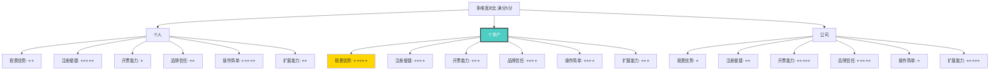

### 💰 税费差异对比（月入3万场景）

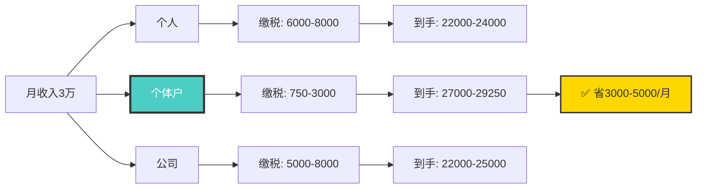

### 🚀 推荐行动路径

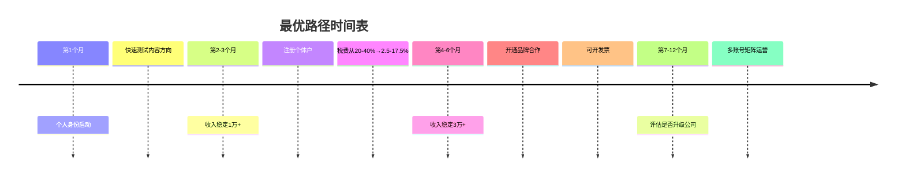

### ⚡ 一句话总结

- **个人**：没钱的时候用，注册快，但税费高
- **个体户**：**最推荐**，税费低，能开票，操作简单
- **公司**：有钱的时候考虑，适合大项目，但税费高、麻烦

---

## 详细分析章节

## 核心结论

**优先推荐**: 个体户 > 个人 > 公司

**原因**: 个体户税费最低，且能开发票接品牌合作；个人起步最快；公司税费高且不必要。

---

## 📊 可视化图表

### 图表1: 主体选择决策流程图

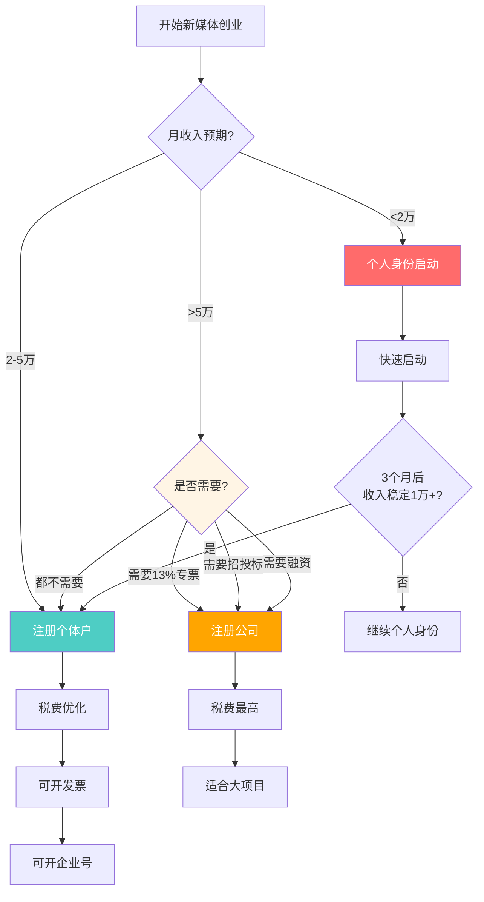

### 图表2: 推荐路径时间轴

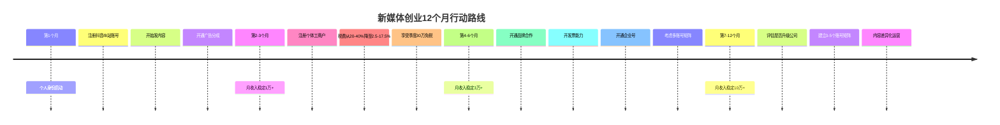

---

## 详细对比表

| 对比维度 | 个人 | 个体户 | 公司（一人有限公司） |
|---------|------|--------|---------------------|
| **注册成本** | ¥0 | ¥0-500 | ¥500-2000 |
| **注册时间** | 即时 | 3-7天 | 7-15天 |
| **税率** | 20%-40%（劳务报酬） | 2.5%-17.5%（经营所得） | 5%（企业所得税）+ 20%（分红个税） |
| **季度免税额度** | ❌ 无 | ✅ 30万 | ❌ 无 |
| **开发票能力** | ❌ 不能 | ✅ 可以（普票） | ✅ 可以（普票+专票） |
| **品牌合作** | ⚠️ 受限（不能开票） | ✅ 可以 | ✅ 可以 |
| **平台广告分成** | ✅ 可以 | ✅ 可以 | ✅ 可以 |
| **知识付费（爱发电）** | ✅ 可以 | ✅ 可以 | ✅ 可以 |
| **带货佣金** | ✅ 可以 | ✅ 可以 | ✅ 可以 |
| **记账复杂度** | 简单（无需记账） | 简单（可定额征收） | 复杂（需专业记账） |
| **注销难度** | 简单 | 简单 | 复杂 |

---

## 个人 vs 个体户 - 本质区别

### ✅ 相同点
1. **都能做新媒体**: 抖音/B站/快手等平台都支持
2. **都能开通广告分成**: 平台实名认证即可
3. **都能做知识付费**: 爱发电/小鹅通等平台支持
4. **都能带货**: 抖音橱窗/商品分享等功能

### ❌ 核心区别

#### 1. **税务成本（最关键）**

**举例**: 月收入3万元

| 主体类型 | 月收入 | 税费 | 实际税率 | 到手收入 |
|---------|--------|------|---------|---------|
| **个人** | ¥30,000 | ¥6,000-8,000 | 20%-26.7% | ¥22,000-24,000 |
| **个体户** | ¥30,000 | ¥750-3,000 | 2.5%-10% | ¥27,000-29,250 |
| **公司** | ¥30,000 | ¥5,000-8,000 | 16.7%-26.7% | ¥22,000-25,000 |

**结论**: 个体户比个人每月省¥3,000-5,000税费

#### 税费对比可视化

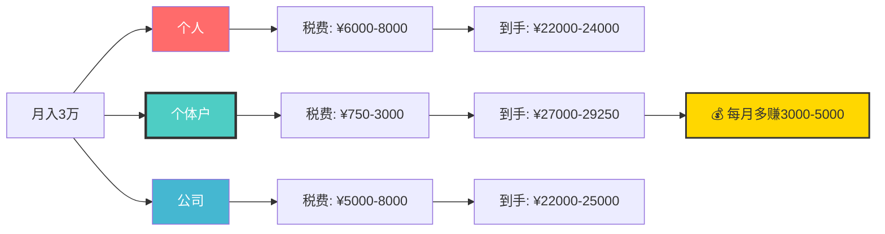

#### 2. **开发票能力**

| 场景 | 个人 | 个体户 | 公司 |
|------|------|--------|------|
| 品牌合作要发票 | ❌ 不能提供 | ✅ 可以开普票 | ✅ 可以开普票+专票 |
| 平台激励要发票 | ❌ 不能提供 | ✅ 可以开普票 | ✅ 可以开普票+专票 |
| 客户要专票（13%税率） | ❌ 不能 | ❌ 不能 | ✅ 可以 |

**影响**: 
- 个人: 大品牌/正规公司合作会受限
- 个体户: 足够应对95%的新媒体合作
- 公司: 只有需要13%专票时才需要

#### 3. **平台政策**

**抖音**:
- 个人: 可以开通星图（广告接单平台）
- 个体户: 可以开通星图 + 可以开企业号
- 公司: 可以开通星图 + 企业号 + 更多营销工具

**B站**:
- 个人: 可以加入创作激励计划
- 个体户: 可以加入创作激励计划 + 可以开企业号
- 公司: 与企业号功能相同

**实际影响**: 
- 前期（0-1万粉丝）: 个人和个体户无区别
- 中期（1-10万粉丝）: 个体户可开企业号，增加信任度
- 后期（10万+粉丝）: 个体户足够，公司不必要

---

## 收入场景模拟

### 场景一: 月收入1-2万（起步阶段）

**推荐**: 个人身份启动

**理由**:
1. 税费差异不大（月入1万，个体户比个人省¥1000-2000）
2. 不需要开发票（小品牌/平台分成不需要）
3. 注册简单（即时开始）

**操作**:
1. 用个人身份注册抖音/B站
2. 开通广告分成
3. 开通爱发电订阅
4. 月收入稳定2万以上后，注册个体户

---

### 场景二: 月收入2-5万（稳定阶段）

**推荐**: 注册个体户

**理由**:
1. 税费省很多（月入3万，个体户比个人省¥3000-5000）
2. 可以开发票（接品牌合作）
3. 可以开企业号（增加信任度）

**操作**:
1. 注册个体户（经营范围: 信息技术服务/咨询服务）
2. 将平台账号升级为企业号（可选）
3. 正常开发票给品牌方
4. 享受季度30万免税额度

---

### 场景三: 月收入5-10万（规模化阶段）

**推荐**: 继续用个体户（或考虑升级公司）

**理由**:
1. 个体户税费仍然最低
2. 如果需要接大公司项目/政府项目 → 升级公司
3. 如果需要招聘3人以上 → 升级公司

**操作**:
1. 继续用个体户（税费最优）
2. 如果需要13%专票/招投标 → 注册公司
3. 如果不需要 → 继续个体户

---

## 新媒体方向 - 最终建议

### ✅ 推荐路径

**第1个月**: 个人身份启动（抖音/B站）
- 注册账号
- 开始发内容
- 开通广告分成

**第2-3个月**: 如果月收入稳定1万+
- 注册个体户
- 将收入转为经营所得（税费从20-40%降至2.5-17.5%）

**第4-6个月**: 如果月收入稳定3万+
- 开通品牌合作（开发票）
- 开通企业号（增加信任度）

**第7-12个月**: 如果月收入稳定10万+
- 评估是否需要升级公司
- 如果需要接大项目/招聘团队 → 升级公司
- 如果不需要 → 继续个体户

---

## 常见问题

### Q1: 个人和个体户，平台会区别对待吗？

**答**: 基本不会。
- 抖音/B站的内容推荐算法，不区分个人/个体户
- 个体户可以开企业号（蓝V认证），增加信任度，但不是必须

### Q2: 个体户需要做账吗？

**答**: 不需要（或很简单）。
- 可以申请"定期定额征收"（税务局直接定税额）
- 不需要专业会计，自己记录收支即可
- 年营收≤120万，基本免税

### Q3: 个体户可以开发票吗？

**答**: 可以。
- 可以开普通发票（1-3%税率）
- 不能开增值税专用发票（13%税率）
- 新媒体99%的合作，普通发票足够

### Q4: 什么时候必须升级为公司？

**答**: 
1. 需要开13%增值税专用发票（大客户要求）
2. 需要接政府/国企项目（需要招投标）
3. 需要融资（投资人要求）
4. 需要招聘3人以上团队（需要正规社保/公积金）

**如果这些都不需要，个体户永远够用。**

---

## 附录：各大平台多账号政策对比

> 本节针对计划矩阵化运营（多个账号）的创业者，分析各大平台的多账号注册政策。

### 核心结论

**所有主流平台都要求"1个手机号只能注册1个账号"**，这是无法绕过的限制。

**注册个体工商户或公司后，可以实名认证更多账号，但仍需要多个手机号注册。**

### 各平台政策对比表

| 平台 | 注册数量限制 | 实名认证限制 | 手机号要求 | 多账号运营难度 | 企业号优势 |
|------|------------|------------|-----------|--------------|-----------|
| **抖音** | 无限制（用不同手机号） | 1个身份证最多3个账号 | 1个手机号=1个账号 | ⭐⭐⭐ 中等 | 蓝V可管理50个子账号 |
| **B站** | 无明确限制 | 1个身份证可绑定多个 | 1个手机号=1个账号 | ⭐⭐ 较容易 | 适合个人多账号 |
| **视频号** | 1个微信=1个视频号 | 1个身份证=1个视频号 | 与微信绑定 | ⭐⭐⭐⭐⭐ 困难 | 企业认证可管理多个 |
| **快手** | 支持3-5个附属账号 | 1个身份证=1个主账号 | 1个手机号=1个账号 | ⭐⭐⭐ 中等 | 企业号可突破限制 |
| **小红书** | 无明确限制 | 1个身份证最多5个 | 1个手机号=1个账号 | ⭐⭐⭐ 中等 | 专业号可关联4个子账号 |

#### 平台多账号能力对比图

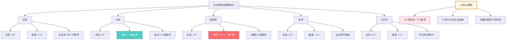

### 个体户/公司能否突破手机号限制？

#### ❌ 不能

**核心答案：无论是个体户还是有限公司，注册账号时仍然需要多个手机号。**

| 项目 | 个人账号 | 个体户（企业号） | 有限公司（企业号） |
|------|---------|----------------|-------------------|
| **手机号要求** | 1个手机号=1个账号 | 仍然是1个手机号=1个账号 | 仍然是1个手机号=1个账号 |
| **实名认证数量** | 1个身份证最多实名1-3个账号 | 1个营业执照可实名2-5个账号 | 1个营业执照可实名5-50个账号 |
| **账号功能** | 未实名功能受限 | 企业认证后功能完整 | 企业认证后功能完整 |

#### ✅ 个体户/公司的真正作用

**可以做到：**
- 实名认证更多账号（最多2-50个，取决于平台）
- 让多个账号都能完整使用（直播、带货、提现等）
- 提升账号权重和信任度
- 享受税收优惠（个体户季度30万免税）

**不能做到：**
- 用1个手机号注册多个账号（这个限制依然存在）

#### 结论

**如果想注册多个账号，你仍然需要：**
1. **多个手机号**（1个账号=1个手机号）
2. **注册个体户/公司**（这样才能实名认证多个账号，否则功能受限）

**两者缺一不可！**

### 多账号运营的手机号解决方案

| 方案 | 成本 | 优点 | 缺点 | 推荐指数 |
|------|------|------|------|---------|
| **办理多张手机卡** | ¥10-50/月/张 | 合规、稳定 | 成本较高 | ⭐⭐⭐⭐⭐ |
| **注册个体户/公司** | ¥0-2000一次性 | 可实名更多账号 | 仍需多个手机号 | ⭐⭐⭐⭐⭐ |
| **使用家人/朋友手机号** | ¥0 | 成本低 | 存在信任风险 | ⭐⭐⭐ |
| **购买账号** | ¥50-500/个 | 快速 | 风险极高 | ❌ 不推荐 |
| **使用虚拟手机号** | ¥0-10/个 | 便宜 | 可能被封 | ❌ 不推荐 |

**推荐方案**：
- 个人最多可办**15张手机卡/身份证**
- 前期测试：办理2-3张手机卡
- 稳定后：注册个体户 + 办理企业手机号

### 多账号运营策略建议

#### 第一阶段（测试期）：1-2个账号

- **平台选择**：抖音 + B站
- **账号定位**：
  - 账号1：AI工具开发实战（主账号）
  - 账号2：编程技巧分享（副账号，测试不同风格）
- **所需材料**：2个手机号 + 1个身份证

#### 第二阶段（扩展期）：注册个体工商户

- **时机**：当有稳定收入后（约3-6个月后）
- **优势**：
  - 可注册企业号，突破实名限制
  - 享受税收优惠
  - 提升品牌可信度
- **成本**：约¥500 + 3-7工作日

#### 第三阶段（矩阵期）：3-5个账号

- **账号矩阵**：
  - 主账号：技术教程（抖音+B站）
  - 副账号1：AI工具评测（小红书+视频号）
  - 副账号2：编程干货（知乎+公众号）
- **运营策略**：内容差异化 + 互相引流

### 风险提示

1. **平台打击力度加强**：2023年网信办要求"一人一号"实名注册，违规可能被限流、封号
2. **避免违规操作**：
   - ❌ 不要购买账号（风险极高）
   - ❌ 不要使用虚拟手机号
   - ❌ 不要频繁切换设备登录多个账号
   - ✅ 使用官方允许的方式（企业认证、家庭号等）
3. **内容差异化**：即使多账号，也要避免内容高度相似，建议不同账号做不同垂直领域

---

## 综合总结与行动建议

### 核心结论

**新媒体方向，个体户是最优选择。**

| 主体 | 推荐指数 | 适用阶段 | 多账号运营能力 |
|------|---------|---------|--------------|
| 个人 | ⭐⭐⭐ | 起步阶段（月入<2万） | 受限（1-3个账号） |
| 个体户 | ⭐⭐⭐⭐⭐ | 稳定阶段（月入2-10万） | 优秀（2-5个账号） |
| 公司 | ⭐⭐ | 规模化阶段（月入>10万 + 需要融资/招投标） | 最强（5-50个账号） |

#### 📊 推荐指数饼图

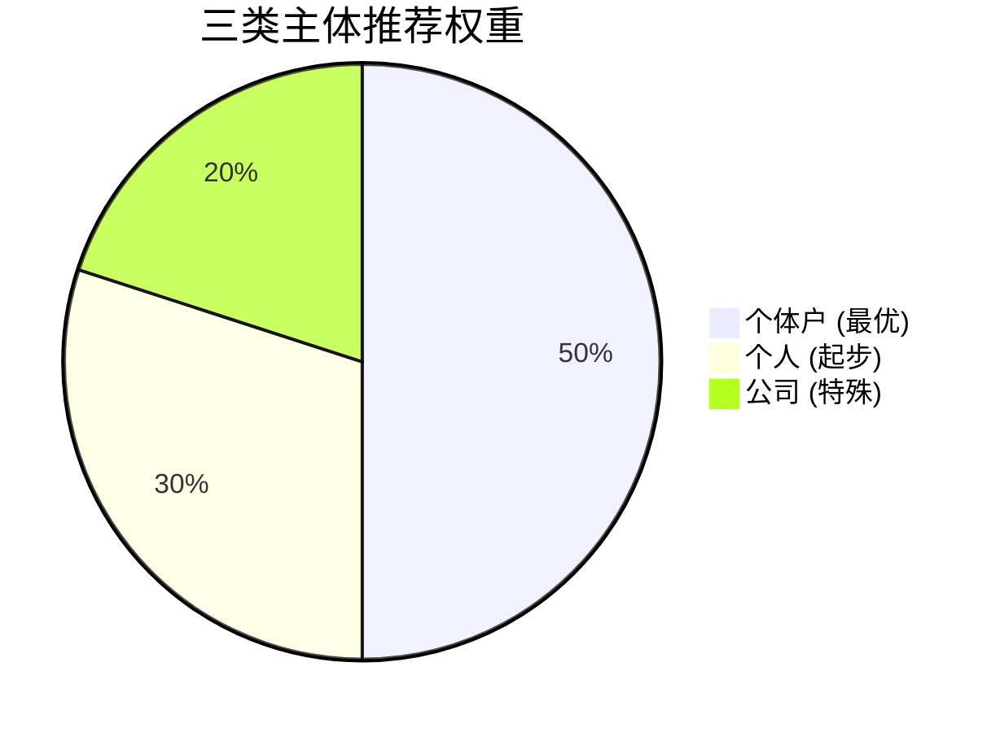

#### 🎯 最终决策流程图

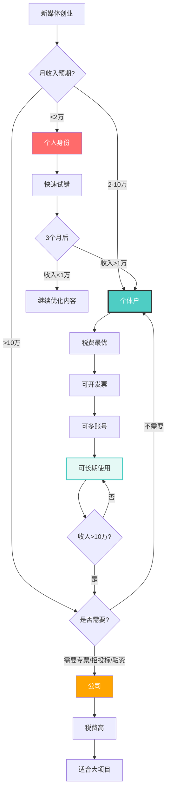

#### 📈 主体对比总结图

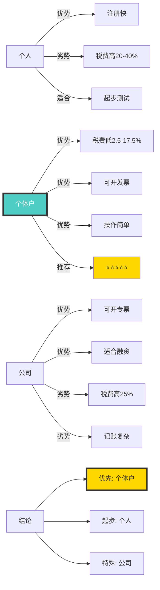

### 完整行动路线图

#### 📅 12个月甘特图

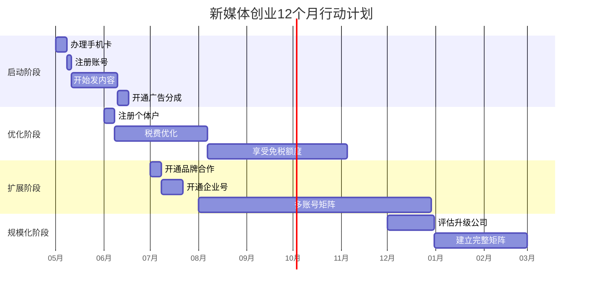

#### 第1个月：个人身份启动
- ✅ 办理2-3张手机卡（用于多平台注册）
- ✅ 用个人身份注册抖音/B站
- ✅ 开始发内容
- ✅ 开通广告分成

#### 第2-3个月：收入稳定后注册个体户
- ✅ 如果月收入稳定1万+
- ✅ 注册个体户（经营范围：信息技术服务/咨询服务）
- ✅ 将收入转为经营所得（税费从20-40%降至2.5-17.5%）
- ✅ 享受季度30万免税额度

#### 第4-6个月：扩展与品牌合作
- ✅ 如果月收入稳定3万+
- ✅ 开通品牌合作（开发票）
- ✅ 开通企业号（增加信任度）
- ✅ 考虑注册第2-3个账号（需要更多手机号）

#### 第7-12个月：矩阵化运营
- ✅ 如果月收入稳定10万+
- ✅ 评估是否需要升级公司
- ✅ 如果需要接大项目/招聘团队 → 升级公司
- ✅ 如果不需要 → 继续个体户
- ✅ 建立3-5个账号的矩阵

### 关键要点

1. **手机号是核心瓶颈**：所有平台都要求1个手机号只能注册1个账号
2. **个体户/公司不能突破手机号限制**：仍然需要多个手机号
3. **个体户/公司的价值**：可以实名认证更多账号，让账号功能完整
4. **税费优势明显**：个体户比个人每月省¥3,000-5,000税费
5. **内容差异化至关重要**：即使多账号，也要避免内容高度相似

### 下一步行动清单

- [ ] 办理2-3张手机卡（用于测试期）
- [ ] 用个人身份注册抖音/B站账号
- [ ] 开始制作和发布内容（快速试错）
- [ ] 月收入稳定1万以上后，注册个体工商户
- [ ] 月收入稳定3万以上后，考虑多账号矩阵
- [ ] 内容差异化定位，避免同质化

---

**文档版本**: v2.0（新增多账号政策对比）  
**最后更新**: 2026/5/10
