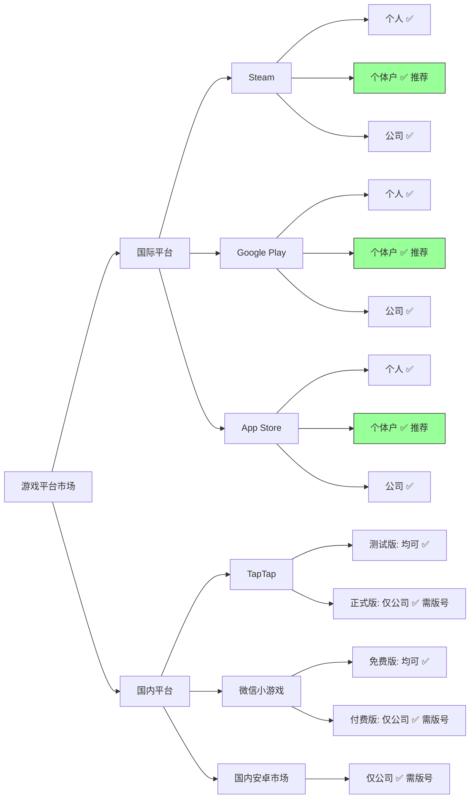
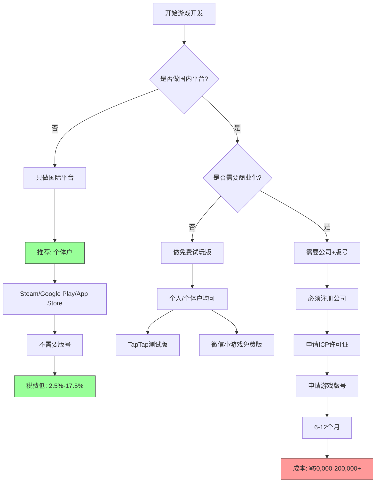
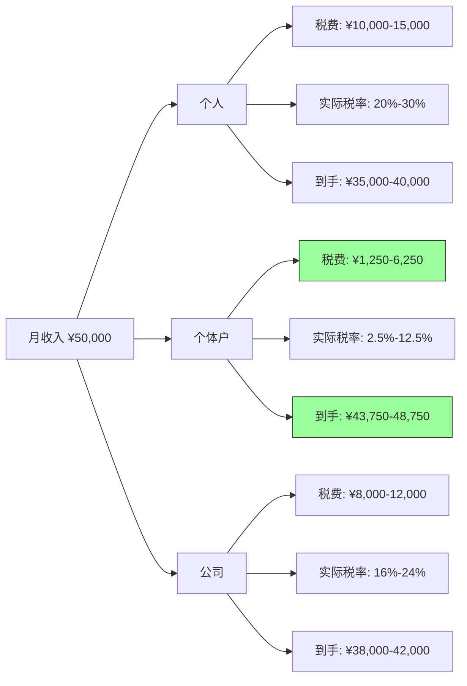
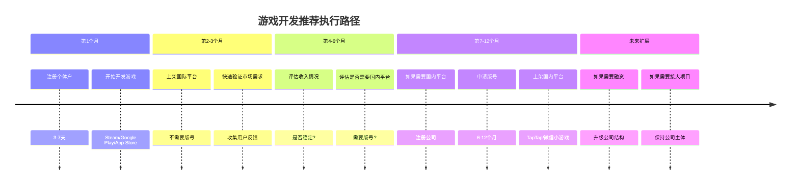
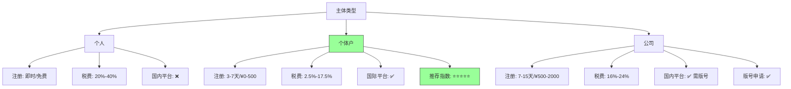

# 游戏开发方向 - 个人/个体户/公司对比分析

**日期**: 2026/5/10  
**适用方向**: 独立游戏/小游戏/游戏App开发

---

## 📊 快速总结（本质区别与市场对比）

### 本质区别

| 维度 | 个人 | 个体户 | 公司 |
|------|------|--------|------|
| **法律地位** | 自然人 | 非法人经营主体 | 法人主体 |
| **版号申请** | ❌ 不能 | ❌ 不能 | ✅ 可以 |
| **国内平台商业化** | ❌ 不能 | ❌ 不能* | ✅ 可以 |
| **税费成本** | 20%-40% | 2.5%-17.5% | 16%-24% |
| **开发票** | ❌ 不能 | ✅ 普票 | ✅ 普票+专票 |

> *注：个体户能否运营微信小游戏付费版存在争议，建议按"不能"处理

### 市场对比：国际 vs 国内平台

### 快速决策指南

**如果你...**
- ✅ **只做国际平台** → 选择 **个体户**（税费低、注册快）
- ✅ **要做国内平台商业化** → 必须 **公司**（需要版号）
- ❓ **不确定** → 先 **个体户**，未来需要时再升级为公司

### 成本对比（月收入5万元）

| 主体 | 税费 | 到手收入 | 节省 |
|------|------|---------|------|
| 个人 | ¥10,000-15,000 | ¥35,000-40,000 | - |
| **个体户** | **¥1,250-6,250** | **¥43,750-48,750** | **多¥7,000-10,000** |
| 公司 | ¥8,000-12,000 | ¥38,000-42,000 | 多¥3,000-7,000 |

**结论**: 个体户在国际平台场景下综合优势明显

---

## 核心结论

**关键发现**: 国内游戏运营需要**版号**，而版号申请**必须为公司**（个体户和个人都不能申请）。

**优先推荐**: 
- **国际平台（Steam/Google Play/App Store）**: 个体户/个人均可
- **国内平台**: 必须注册公司（如需商业化运营）

---

## 详细对比表

| 对比维度 | 个人 | 个体户 | 公司（一人有限公司） |
|---------|------|--------|---------------------|
| **注册成本** | ¥0 | ¥0-500 | ¥500-2000 |
| **注册时间** | 即时 | 3-7天 | 7-15天 |
| **税率** | 20%-40%（劳务报酬） | 2.5%-17.5%（经营所得） | 5%（企业所得税）+ 20%（分红个税） |
| **Steam上架** | ✅ 可以 | ✅ 可以 | ✅ 可以 |
| **Google Play上架** | ✅ 可以 | ✅ 可以 | ✅ 可以 |
| **App Store上架** | ✅ 可以 | ✅ 可以 | ✅ 可以 |
| **TapTap上架（测试版）** | ✅ 可以 | ✅ 可以 | ✅ 可以 |
| **TapTap上架（正式版）** | ⚠️ 受限 | ⚠️ 受限 | ✅ 可以（需版号） |
| **微信小游戏（免费）** | ✅ 可以 | ✅ 可以 | ✅ 可以 |
| **微信小游戏（付费）** | ❌ 不能 | ❌ 不能* | ✅ 可以（需版号） |
| **游戏版号申请** | ❌ 不能 | ❌ 不能 | ✅ 可以 |
| **ICP许可证** | ❌ 不能 | ❌ 不能 | ✅ 可以 |
| **开发票能力** | ❌ 不能 | ✅ 可以（普票） | ✅ 可以（普票+专票） |
| **国内外包接单** | ❌ 受限 | ✅ 可以 | ✅ 可以 |

> *注：部分信息显示微信小游戏付费需要公司资质，个体户可能不支持

---

## 可视化图表

### 决策流程图：选择哪种主体？

### 税务成本对比（月收入5万元）

**结论**: 个体户比个人每月省 ¥7,000-10,000 税费

---

## 国内游戏运营 - 关键资质要求

### ⚠️ 核心门槛：游戏版号

**什么是游戏版号？**
- 全称："游戏出版备案"
- 由国家新闻出版总署颁发
- **必须为公司才能申请**（个体户和个人都不能申请）

**申请版号的要求：**
1. **主体要求**: 必须为企业法人（公司），个体户和个人无法申请
2. **注册资本**: 建议≥100万
3. **经营范围**: 必须包含"网络游戏运营"、"互联网信息服务"
4. **其他资质**: ICP许可证、网络文化经营许可证
5. **时间成本**: 6-12个月
6. **金钱成本**: ¥50,000-200,000+

---

## 各平台详细分析

### 1️⃣ Steam（国际平台）

**支持主体**: 个人/个体户/公司 ✅

**要求**:
- 注册Steamworks开发者账号
- 支付$100/游戏的Steam Direct费用（营收超$1000可退还）
- 无版号要求（国际平台）

**税费**:
- 个人: 20-40%（劳务报酬）
- 个体户: 2.5%-17.5%（经营所得）✅ 推荐
- 公司: 16%-24%（企业所得税+分红个税）

**结论**: **个体户最优**（成本低+税费低）

---

### 2️⃣ Google Play（国际平台）

**支持主体**: 个人/个体户/公司 ✅

**要求**:
- 注册Google Play开发者账号（¥167一次性）
- 2025年新政：需要20人测试+持续测试后才能正式发布
- 无版号要求（国际平台）

**税费**: 同Steam

**结论**: **个体户最优**

---

### 3️⃣ App Store（国际平台）

**支持主体**: 个人/个体户/公司 ✅

**要求**:
- 注册Apple Developer账号（¥647/年）
- 无版号要求（国际平台）

**税费**: 同Steam

**结论**: **个体户最优**

---

### 4️⃣ TapTap（国内平台）

**支持主体**: 
- **测试版/试玩版**: 个人/个体户/公司 ✅
- **正式版（商业化）**: 必须公司 + 版号 ⚠️

**要求**:
- 测试版：不需要软著、不需要版号
- 正式版：需要软著 + 版号 + 公司主体

**结论**: 
- 如果做免费试玩版 → 个人/个体户均可
- 如果要商业化运营 → 必须注册公司 + 申请版号

---

### 5️⃣ 微信小游戏（国内平台）

**支持主体**: 
- **免费小游戏**: 个人/个体户/公司 ✅
- **付费小游戏**: 必须公司 + 版号 ⚠️

**要求**:
- 免费版：软著 + 游戏自审自查报告
- 付费版：版号 + ICP证 + 网络文化经营许可证 + 公司主体

**重要发现**:
- 部分信息显示"个体户不行"，必须为公司
- 微信小游戏商业化（付费/内购/广告）需要完整资质

**结论**: 
- 如果做免费小游戏 → 个体户可以
- 如果要付费运营 → 必须注册公司 + 申请版号

---

### 6️⃣ 国内安卓市场（小米/OPPO/vivo/应用宝）

**支持主体**: 必须公司 ⚠️

**要求**:
- 必须为公司（个体户和个人都不能上架）
- 需要版号 + ICP证 + 软著

**结论**: **必须注册公司**

---

## 个人 vs 个体户 vs 公司 - 本质区别

### ✅ 相同点（国际平台）
1. **都能上架Steam/Google Play/App Store**: 三大国际平台支持个人和个体户
2. **都不需要版号**: 国际平台不要求中国版号
3. **都能申请软著**: 个人和个体户都可以

### ❌ 核心区别

#### 1. **国内游戏运营资质**

| 资质 | 个人 | 个体户 | 公司 |
|------|------|--------|------|
| 游戏版号 | ❌ 不能申请 | ❌ 不能申请 | ✅ 可以申请 |
| ICP许可证 | ❌ 不能申请 | ❌ 不能申请 | ✅ 可以申请 |
| 网络文化经营许可证 | ❌ 不能申请 | ❌ 不能申请 | ✅ 可以申请 |
| 微信小游戏付费 | ❌ 不能 | ❌ 不能* | ✅ 可以 |

> *注：部分信息显示个体户不能运营付费小游戏

**影响**: 
- 个人/个体户：只能做国际平台（Steam/Google Play/App Store）
- 公司：可以做国内平台（TapTap/微信小游戏/国内安卓市场）

#### 2. **税务成本**

**举例**: 月收入5万元（游戏销售收入）

| 主体类型 | 月收入 | 税费 | 实际税率 | 到手收入 |
|---------|--------|------|---------|---------|
| **个人** | ¥50,000 | ¥10,000-15,000 | 20%-30% | ¥35,000-40,000 |
| **个体户** | ¥50,000 | ¥1,250-6,250 | 2.5%-12.5% | ¥43,750-48,750 |
| **公司** | ¥50,000 | ¥8,000-12,000 | 16%-24% | ¥38,000-42,000 |

**结论**: 个体户比个人每月省¥7,000-10,000税费

#### 3. **开发票能力**

| 场景 | 个人 | 个体户 | 公司 |
|------|------|--------|------|
| 接外包项目要发票 | ❌ 不能 | ✅ 可以开普票 | ✅ 可以开普票+专票 |
| 平台激励要发票 | ❌ 不能 | ✅ 可以开普票 | ✅ 可以开普票+专票 |

---

## 收入场景模拟

### 场景一: 只做国际平台（Steam/Google Play/App Store）

**推荐**: 个体户

**理由**:
1. 国际平台不需要版号
2. 个体户税费最低（2.5%-17.5%）
3. 可以开发票（接外包项目）

**操作**:
1. 注册个体户（3-7天）
2. 注册Steam/Google Play/App Store开发者账号
3. 上架游戏（不需要版号）

---

### 场景二: 做国内平台（TapTap/微信小游戏）

**推荐**: 公司

**理由**:
1. 国内平台商业化需要版号
2. 版号必须为公司才能申请
3. 微信小游戏付费需要公司资质

**操作**:
1. 注册公司（7-15天）
2. 申请ICP许可证（1-2个月）
3. 申请游戏版号（6-12个月）
4. 上架国内平台

**成本**: 
- 时间成本: 6-12个月（版号申请）
- 金钱成本: ¥50,000-200,000+（版号申请）

---

### 场景三: 国内外都做

**推荐路径**:
1. **第一阶段**（0-6个月）: 注册个体户，上架国际平台
   - 快速验证市场需求
   - 低成本启动
   - 积累用户和收入

2. **第二阶段**（6-12个月）: 如果收入稳定，且需要国内平台
   - 注册公司
   - 申请版号
   - 上架国内平台

---

## 游戏开发方向 - 最终建议

### ✅ 推荐路径（低成本启动）

**第1个月**: 注册个体户 + 开发游戏
- 注册个体户（3-7天）
- 开始开发游戏（Steam/Google Play/App Store）

**第2-3个月**: 上架国际平台
- 上架Steam/Google Play/App Store
- 不需要版号
- 快速验证市场需求

**第4-6个月**: 评估是否需要国内平台
- 如果收入稳定，且需要国内用户 → 注册公司 + 申请版号
- 如果收入稳定，但不需要国内平台 → 继续个体户

**第7-12个月**: 规模化
- 如果需要融资/接大项目 → 升级公司
- 如果不需要 → 继续个体户

**执行时间线图**:

---

### Q1: 个人和个体户，游戏平台会区别对待吗？

**答**: 基本不会。
- Steam/Google Play/App Store的审核，不区分个人/个体户
- 只要游戏质量过关，都能上架
- TapTap/微信小游戏的商业化限制是政策限制，不是区别对待

### Q2: 个体户可以做付费游戏吗？

**答**: 分平台。
- **国际平台（Steam/Google Play/App Store）**: 可以 ✅
- **国内平台（TapTap/微信小游戏）**: 不可以（需要版号+公司）❌

### Q3: 如果不申请版号，只做免费游戏+广告，可以吗？

**答**: 可以，但有风险。
- **理论**: 免费游戏+广告不需要版号
- **实际**: 国内平台可能要求补交版号
- **建议**: 只做国际平台（不需要版号）

### Q4: 版号申请成本太高，有没有替代方案？

**答**: 有。
1. **只做国际平台**: Steam/Google Play/App Store不需要版号
2. **找发行商**: 发行商有版号，可以帮你上架国内平台（分成模式）
3. **做免费游戏**: 只靠广告变现（但国内平台可能要求版号）

### Q5: 什么时候必须升级为公司？

**答**: 
1. 需要做国内平台商业化（TapTap/微信小游戏）
2. 需要申请版号
3. 需要接大公司项目/政府项目
4. 需要融资

**如果这些都不需要，个体户永远够用。**

---

## 总结

**游戏开发方向，推荐路径：个体户（国际平台）→ 公司（国内平台）**

| 主体 | 推荐指数 | 适用场景 |
|------|---------|---------|
| 个人 | ⭐⭐ | 测试阶段（不想注册个体户） |
| 个体户 | ⭐⭐⭐⭐⭐ | 国际平台（Steam/Google Play/App Store） |
| 公司 | ⭐⭐⭐ | 国内平台（需要版号） |

**主体对比可视化**:

**关键决策点**:
- 是否做国内平台（TapTap/微信小游戏/国内安卓市场）？
  - 不做 → 个体户（国际平台）
  - 做 → 公司（需要版号）

**行动建议**:
1. **现在**: 注册个体户（3-7天）
2. **立即**: 上架Steam/Google Play/App Store（不需要版号）
3. **未来**: 如果需要国内平台 → 再注册公司（随时可升级）

---

## 附录：游戏版号申请流程（如需国内平台）

### 所需材料
1. 公司营业执照（经营范围需包含"网络游戏运营"）
2. ICP许可证
3. 网络文化经营许可证
4. 软件著作权证书
5. 游戏自审自查报告
6. 游戏测试账号和密码

### 申请流程
1. 准备材料（1-2个月）
2. 提交至省级出版管理部门（1-2个月）
3. 省级审核通过后，提交至国家新闻出版总署（3-6个月）
4. 获批后获得版号（总时长6-12个月）

### 成本估算
- 时间成本: 6-12个月
- 金钱成本: ¥50,000-200,000+
- 建议: 找专业代理机构办理

---

**文档版本**: v1.0  
**最后更新**: 2026/5/10
