# 软件开发方向 - 个人/个体户/公司对比分析

**日期**: 2026/5/10  
**适用方向**: App开发/小程序/游戏开发/外包接单

---

## 📌 快速总结：本质区别与市场对比

### 💡 本质区别一句话总结

| 主体类型 | 本质 | 最大优势 | 最大劣势 |
|---------|------|---------|---------|
| **个人** | 自然人身份 | 零成本、即时开始 | 不能开发票、受限多 |
| **个体户** | 个体工商户 | **税费最低、功能完整** | 不能上架国内安卓市场 |
| **公司** | 企业法人 | 可上架所有市场、接大项目 | 税费高、操作复杂 |

### 🎯 核心差异对比

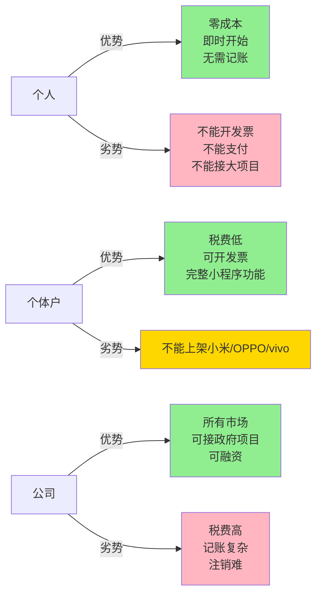

### 📱 应用市场支持对比（最关键区别）

| 应用市场 | 个人 | 个体户 | 公司 | 说明 |
|---------|------|--------|------|------|
| **App Store** | ✅ | ✅ | ✅ | 三大平台都支持 |
| **Google Play** | ✅ | ✅ | ✅ | 三大平台都支持 |
| **华为** | ✅ | ✅ | ✅ | 三大平台都支持 |
| **小米** | ❌ | ❌ | ✅ | **必须公司** |
| **OPPO** | ⚠️ | ⚠️ | ✅ | **必须公司** |
| **vivo** | ❌ | ❌ | ✅ | **必须公司** |
| **应用宝** | ❌ | ⚠️ | ✅ | 个体户可能支持 |

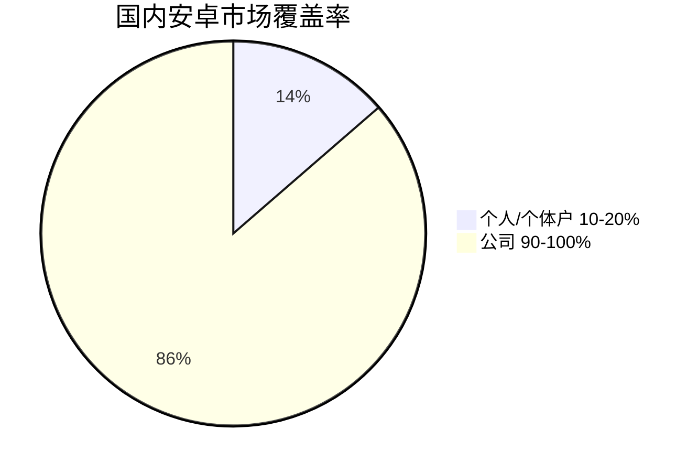

### 💰 税费对比（月收入5万举例）

| 主体类型 | 税费 | 实际税率 | 到手收入 | 年省税费 |
|---------|------|---------|---------|---------|
| **个人** | ¥10,000-15,000 | 20%-30% | ¥35,000-40,000 | - |
| **个体户** | ¥1,250-6,250 | 2.5%-12.5% | ¥43,750-48,750 | **省8-12万/年** |
| **公司** | ¥8,000-12,000 | 16%-24% | ¥38,000-42,000 | - |

### 🎯 如何选择？决策树

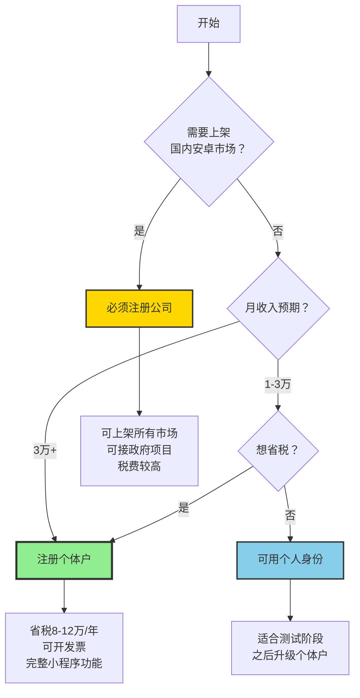

### 📊 推荐指数

| 主体 | 推荐指数 | 适用场景 |
|------|---------|---------|
| 个人 | ⭐⭐ | 测试阶段（不想注册个体户） |
| **个体户** | **⭐⭐⭐⭐⭐** | **大部分场景（推荐）** |
| 公司 | ⭐⭐⭐ | 需要国内安卓市场/招投标/融资 |

---

## 核心结论

**优先推荐**: 个体户 > 个人 > 公司

**原因**: 
- 个体户税费低，且能上架大部分应用市场
- 个人只能上架部分平台（华为/Google Play）
- 公司税费高，且国内安卓市场（小米/OPPO/vivo）必须要求公司

---

## 主体选择决策流程图

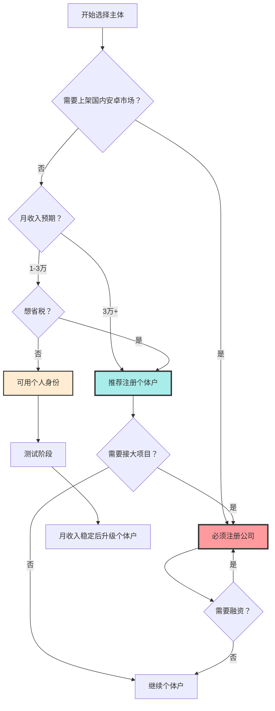

---

## 详细对比表

| 对比维度 | 个人 | 个体户 | 公司（一人有限公司） |
|---------|------|--------|---------------------|
| **注册成本** | ¥0 | ¥0-500 | ¥500-2000 |
| **注册时间** | 即时 | 3-7天 | 7-15天 |
| **税率** | 20%-40%（劳务报酬） | 2.5%-17.5%（经营所得） | 5%（企业所得税）+ 20%（分红个税） |
| **季度免税额度** | ❌ 无 | ✅ 30万 | ❌ 无 |
| **开发票能力** | ❌ 不能 | ✅ 可以（普票） | ✅ 可以（普票+专票） |
| **App Store上架** | ✅ 可以 | ✅ 可以 | ✅ 可以 |
| **Google Play上架** | ✅ 可以 | ✅ 可以 | ✅ 可以 |
| **华为应用市场上架** | ✅ 可以 | ✅ 可以 | ✅ 可以 |
| **小米应用市场上架** | ❌ 不能 | ❌ 不能 | ✅ 可以 |
| **OPPO应用市场上架** | ⚠️ 即将开放 | ⚠️ 待确认 | ✅ 可以 |
| **vivo应用市场上架** | ❌ 不能 | ❌ 不能 | ✅ 可以 |
| **应用宝上架** | ❌ 不能 | ⚠️ 可能支持 | ✅ 可以 |
| **微信小程序** | ⚠️ 受限（不能支付） | ✅ 可以 | ✅ 可以 |
| **软件著作权申请** | ✅ 可以 | ✅ 可以 | ✅ 可以 |
| **外包接单开发票** | ❌ 不能 | ✅ 可以 | ✅ 可以 |
| **记账复杂度** | 简单（无需记账） | 简单（可定额征收） | 复杂（需专业记账） |
| **注销难度** | 简单 | 简单 | 复杂 |

---

## 个人 vs 个体户 - 本质区别

### ✅ 相同点
1. **都能上架iOS/Google Play/华为**: 这三大平台支持个人和个体户
2. **都能申请软件著作权**: 个人和个体户都可以
3. **都能做外包接单**: 猪八戒/程序员客栈等平台支持

### ❌ 核心区别

#### 1. **税务成本（最关键）**

**举例**: 月收入5万元（应用销售收入）

| 主体类型 | 月收入 | 税费 | 实际税率 | 到手收入 |
|---------|--------|------|---------|---------|
| **个人** | ¥50,000 | ¥10,000-15,000 | 20%-30% | ¥35,000-40,000 |
| **个体户** | ¥50,000 | ¥1,250-6,250 | 2.5%-12.5% | ¥43,750-48,750 |
| **公司** | ¥50,000 | ¥8,000-12,000 | 16%-24% | ¥38,000-42,000 |

**结论**: 个体户比个人每月省¥7,000-10,000税费

#### 税务成本对比图

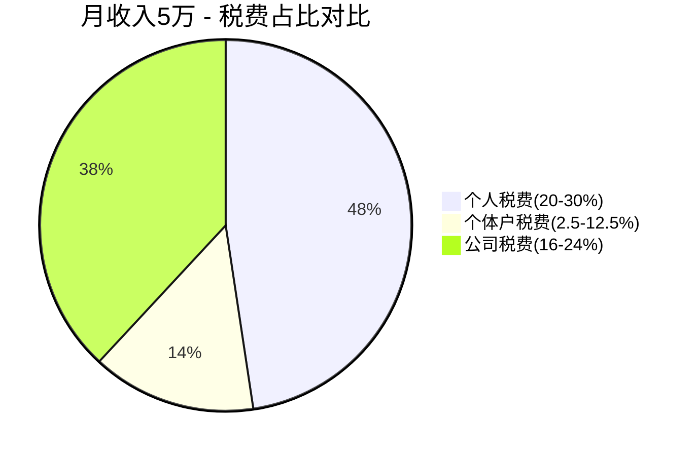

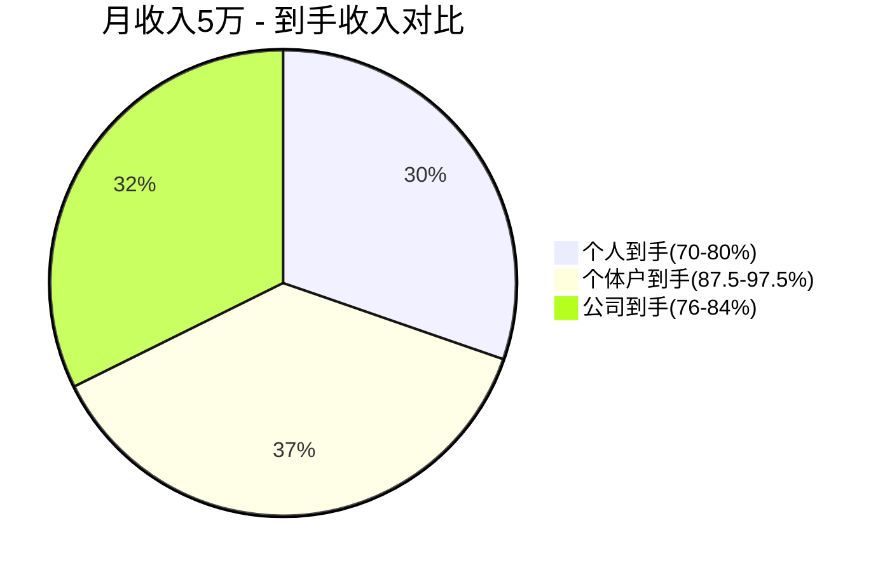

#### 2. **应用市场上架权限**

**国内市场覆盖**:

| 应用市场 | 个人 | 个体户 | 公司 |
|---------|------|--------|------|
| App Store | ✅ 100% | ✅ 100% | ✅ 100% |
| Google Play | ✅ 100% | ✅ 100% | ✅ 100% |
| 华为应用市场 | ✅ 100% | ✅ 100% | ✅ 100% |
| 小米应用市场 | ❌ 0% | ❌ 0% | ✅ 100% |
| OPPO应用市场 | ⚠️ 0%（即将开放） | ⚠️ 待确认 | ✅ 100% |
| vivo应用市场 | ❌ 0% | ❌ 0% | ✅ 100% |
| 应用宝 | ❌ 0% | ⚠️ 可能支持 | ✅ 100% |
| **国内安卓覆盖率** | **10-20%** | **10-20%** | **90-100%** |

**结论**: 
- 如果只做iOS + Google Play + 华为 → 个人/个体户都够用
- 如果想覆盖国内安卓全市场 → 必须注册公司

#### 应用市场支持情况流程图

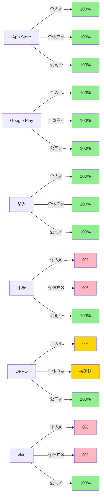

#### 3. **微信小程序功能**

| 功能 | 个人 | 个体户 | 公司 |
|------|------|--------|------|
| 发布小程序 | ✅ 可以 | ✅ 可以 | ✅ 可以 |
| 开通支付功能 | ❌ 不能 | ✅ 可以 | ✅ 可以 |
| 认证（蓝V） | ❌ 不能 | ✅ 可以 | ✅ 可以 |
| 附近的小程序 | ❌ 不能 | ✅ 可以 | ✅ 可以 |

**影响**: 
- 个人: 不能做付费小程序（无法接入支付）
- 个体户: 可以做付费小程序，完整功能
- 公司: 与个体户功能相同

#### 微信小程序功能对比图

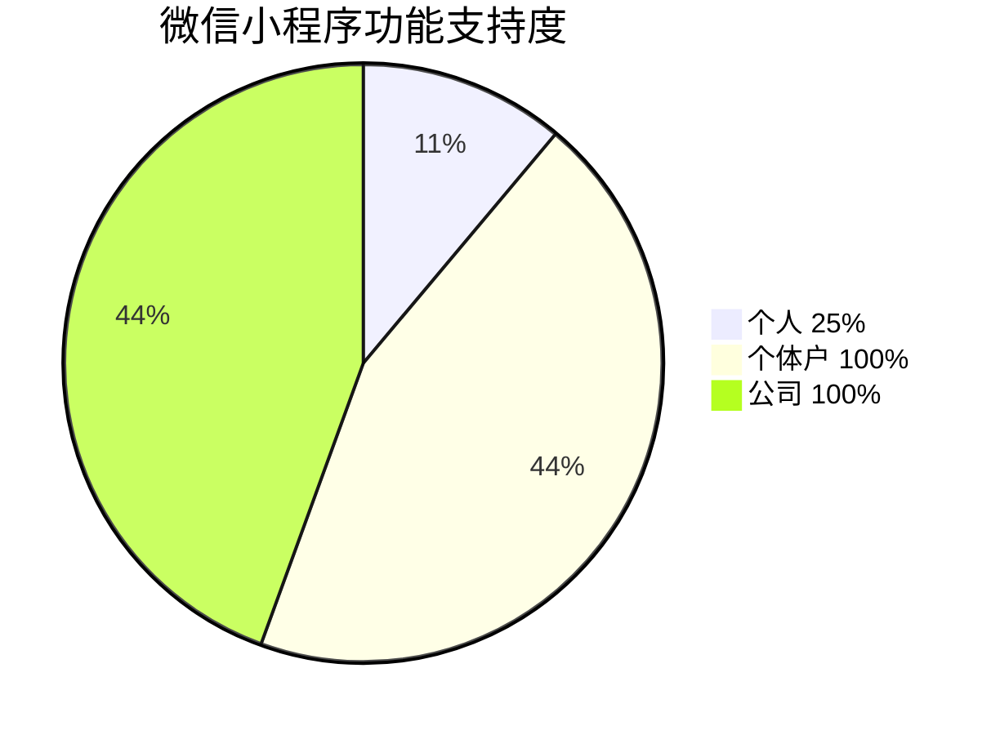

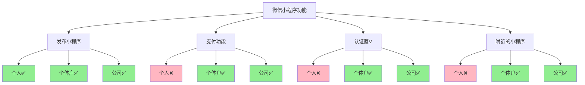

#### 4. **外包接单开发票**

| 场景 | 个人 | 个体户 | 公司 |
|------|------|--------|------|
| 客户要发票 | ❌ 不能提供 | ✅ 可以开普票 | ✅ 可以开普票+专票 |
| 接大公司项目 | ❌ 很难 | ✅ 可以 | ✅ 可以 |
| 接政府项目 | ❌ 不能 | ❌ 不能 | ✅ 可以 |

**影响**: 
- 个人: 只能接小项目/个人客户
- 个体户: 可以接大部分商业项目
- 公司: 可以接所有项目（包括政府/国企）

#### 外包接单能力对比图

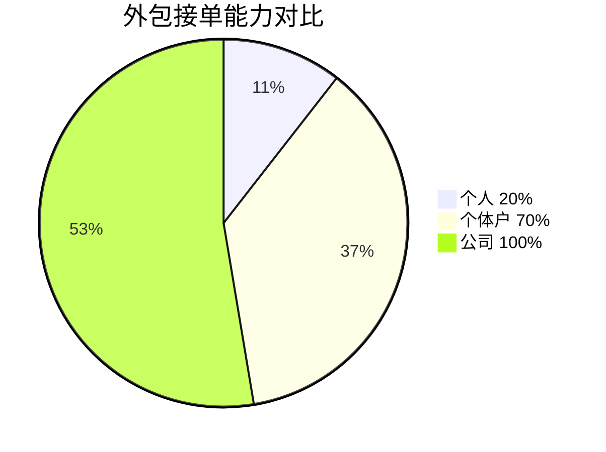

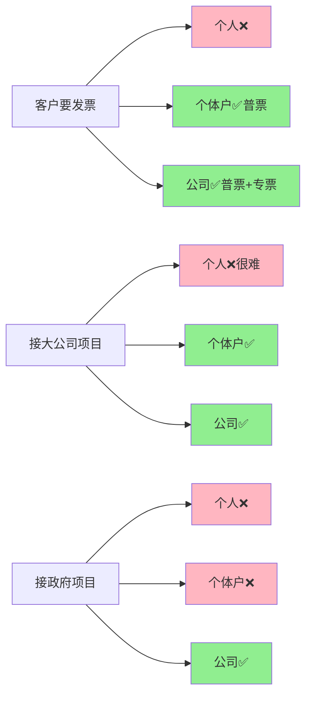

---

## 收入场景模拟

### 场景一: 月收入1-3万（起步阶段）

**来源**: App Store/Google Play销售 + 广告分成

**推荐**: 个人身份启动（或立即注册个体户）

**理由**:
1. iOS/Google Play/华为都支持个人开发者
2. 不需要国内安卓市场（小米/OPPO/vivo）
3. 税费差异大（个体户比个人省¥2000-5000/月）

**操作**:
1. **方案A**: 用个人身份注册开发者账号（立即开始）
   - 注册App Store开发者（¥647/年）
   - 注册Google Play开发者（¥167一次性）
   - 月收入稳定2万以上后，注册个体户

2. **方案B**: 立即注册个体户（推荐）
   - 注册个体户（3-7天）
   - 用个体户身份注册开发者账号
   - 省税 + 为未来做准备

---

### 场景二: 月收入3-10万（稳定阶段）

**来源**: App销售 + 订阅 + 外包接单

**推荐**: 必须注册个体户

**理由**:
1. 税费省很多（月入5万，个体户比个人省¥7000-10000）
2. 可以开发票（接外包项目）
3. 可以做微信小程序支付功能
4. 可以接大部分商业项目

**操作**:
1. 注册个体户（经营范围: 软件开发/信息技术服务）
2. 将App开发者账号升级为个体户身份
3. 开通微信小程序支付功能
4. 开始接外包项目（开发票）

---

### 场景三: 月收入10万+（规模化阶段）

**来源**: App销售 + 订阅 + 外包 + 广告

**推荐**: 个体户 或 升级公司（看需求）

**理由**:
1. **如果不需要国内安卓市场（小米/OPPO/vivo）** → 继续个体户
   - 税费最低
   - 操作简单
   
2. **如果需要国内安卓市场** → 注册公司
   - 小米/OPPO/vivo必须要求公司资质
   - 覆盖90%国内安卓用户
   
3. **如果需要接政府/大公司项目** → 注册公司
   - 需要招投标
   - 需要13%增值税专用发票

**操作**:
1. **评估需求**:
   - 是否需要国内安卓市场？
   - 是否需要接大项目/政府项目？
   - 是否需要融资？

2. **决策**:
   - 如果以上都不需要 → 继续个体户
   - 如果需要 → 注册公司

---

## 国内安卓市场 - 详细分析

### 为什么小米/OPPO/vivo不支持个人/个体户？

**政策变化**:
- 2023年前: 支持个人开发者
- 2024年: 小米率先停止支持个人/个体户
- 2025年: OPPO/vivo跟进（基本不支持）
- 2025年10月: OPPO宣布将开放个人开发者（政策在变化）

**原因**:
1. 监管趋严（防止恶意应用）
2. 责任追溯（公司主体更容易追责）
3. 平台策略（推自己的生态）

---

### 如何应对？

**方案A: 放弃国内安卓市场**
- 只做iOS + Google Play + 华为
- 覆盖约40-50%国内用户
- **但这些用户付费意愿高**

**方案B: 注册公司**
- 可以上架所有国内安卓市场
- 覆盖90%国内用户
- **但税费高，操作复杂**

**方案C: 等待政策变化**
- OPPO宣布将开放个人开发者（2025年12月底）
- vivo可能会跟进
- **但小米可能不会变化**

---

## 软件开发方向 - 最终建议

### 执行计划甘特图

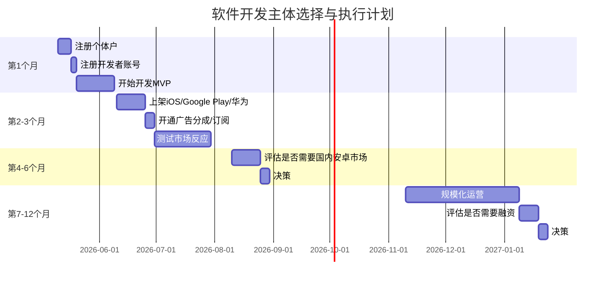

### ✅ 推荐路径

**第1个月**: 注册个体户 + 启动开发
- 注册个体户（3-7天）
- 注册App Store/Google Play/华为开发者账号
- 开始开发MVP

**第2-3个月**: 上架应用
- 上架iOS/Google Play/华为
- 开通广告分成/订阅
- 测试市场反应

**第4-6个月**: 评估是否需要国内安卓市场
- 如果收入稳定，且需要扩大用户群 → 注册公司
- 如果收入稳定，但不需要国内安卓市场 → 继续个体户

**第7-12个月**: 规模化
- 如果需要融资/接大项目 → 升级公司
- 如果不需要 → 继续个体户

---

## 常见问题

### Q1: 个体户和公司，应用商店会区别对待吗？

**答**: 基本不会。
- iOS/Google Play/华为的内容审核，不区分个体户/公司
- 只要应用质量过关，都能上架
- 小米/OPPO/vivo是政策限制，不是区别对待

### Q2: 个体户可以做微信小程序支付吗？

**答**: 可以。
- 个体户可以开通微信支付商户号
- 可以接入支付功能
- 与个人号（不能支付）有本质区别

### Q3: 如果注册公司，税费会增加多少？

**答**: 约增加10-15%。
- 个体户: 实际税率2.5%-17.5%
- 公司: 实际税率16%-24%（企业所得税+分红个税）
- 举例: 月入5万，个体户缴税¥1250-6250，公司缴税¥8000-12000

### Q4: 什么时候必须升级为公司？

**答**: 
1. 需要上架小米/OPPO/vivo（必须公司）
2. 需要接政府/国企项目（需要招投标）
3. 需要融资（投资人要求）
4. 需要开13%增值税专用发票

**如果这些都不需要，个体户永远够用。**

---

## 总结

**软件开发方向，个体户是最优选择（除非需要国内安卓市场）。**

| 主体 | 推荐指数 | 适用场景 |
|------|---------|---------|
| 个人 | ⭐⭐ | 测试阶段（不想注册个体户） |
| 个体户 | ⭐⭐⭐⭐⭐ | 大部分场景（iOS/Google Play/华为 + 微信小程序） |
| 公司 | ⭐⭐⭐ | 需要国内安卓市场/招投标/融资 |

**关键决策点**:
- 是否需要国内安卓市场（小米/OPPO/vivo）？
  - 不需要 → 个体户
  - 需要 → 公司

**行动建议**:
1. 现在注册个体户（3-7天）
2. 上架iOS/Google Play/华为（覆盖40-50%用户）
3. 如果未来需要国内安卓市场 → 再注册公司（随时可升级）

---

## 可视化图表总结

### 主体推荐指数

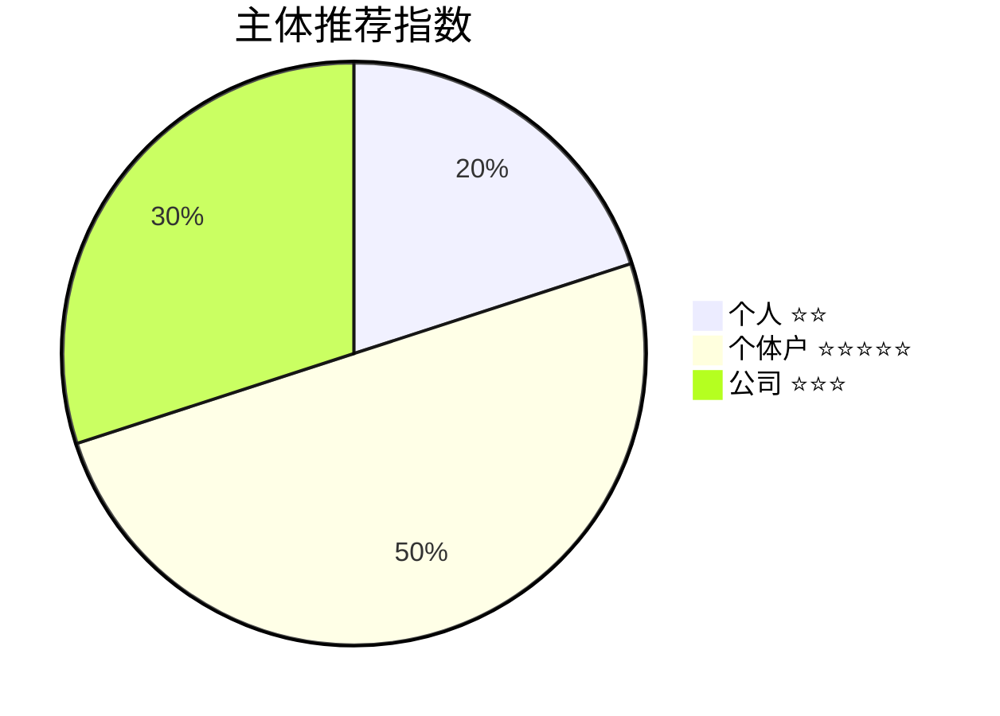

### 多维度综合对比图

```mermaid
flowchart TD
    A[多维度对比] --> B[税费优惠]
    A --> C[上架权限]
    A --> D[开发票]
    A --> E[操作简单]
    A --> F[小程序功能]
    A --> G[接单能力]
    
    B --> B1[个人: ⭐⭐]
    B --> B2[个体户: ⭐⭐⭐⭐⭐]
    B --> B3[公司: ⭐⭐]
    
    C --> C1[个人: ⭐⭐⭐]
    C --> C2[个体户: ⭐⭐⭐]
    C --> C3[公司: ⭐⭐⭐⭐⭐]
    
    D --> D1[个人: ❌]
    D --> D2[个体户: ⭐⭐⭐⭐]
    D --> D3[公司: ⭐⭐⭐⭐⭐]
    
    E --> E1[个人: ⭐⭐⭐⭐⭐]
    E --> E2[个体户: ⭐⭐⭐⭐⭐]
    E --> E3[公司: ⭐⭐]
    
    F --> F1[个人: ⭐⭐]
    F --> F2[个体户: ⭐⭐⭐⭐⭐]
    F --> F3[公司: ⭐⭐⭐⭐⭐]
    
    G --> G1[个人: ❌]
    G --> G2[个体户: ⭐⭐⭐⭐]
    G --> G3[公司: ⭐⭐⭐⭐⭐]
    
    style B2 fill:#90EE90,stroke:#333,stroke-width:3px
    style C3 fill:#90EE90,stroke:#333,stroke-width:3px
    style D2 fill:#90EE90
    style D3 fill:#90EE90
    style E1 fill:#90EE90
    style E2 fill:#90EE90
    style F2 fill:#90EE90
    style F3 fill:#90EE90
    style G2 fill:#90EE90
    style G3 fill:#90EE90
```

### 收入场景与主体选择流程图

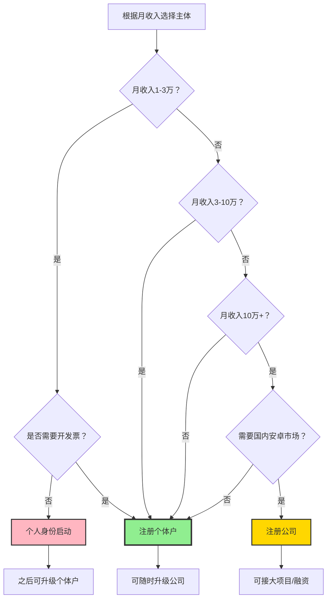

---

**文档版本**: v1.0  
**最后更新**: 2026/5/10
