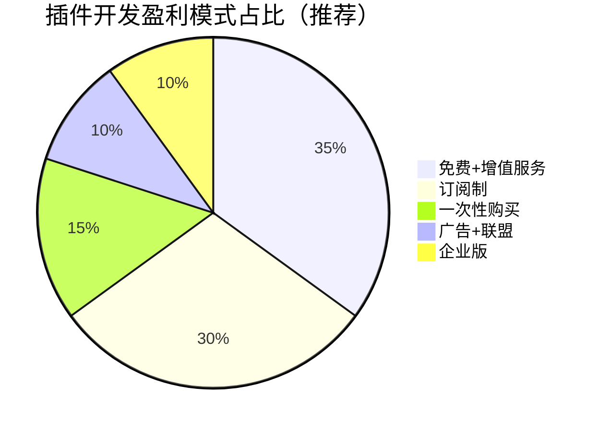
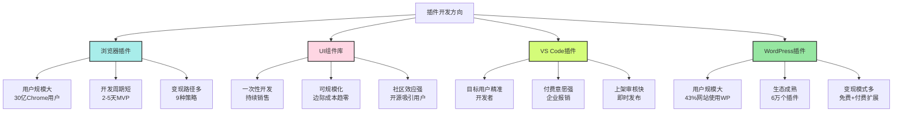
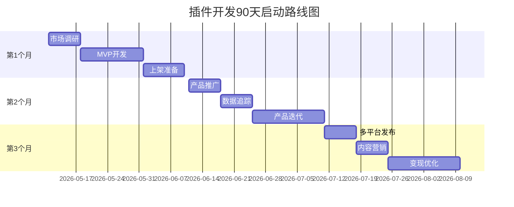
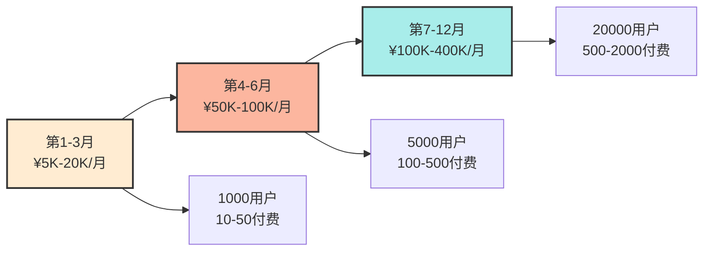

# 软件开发方向 - 插件开发盈利方案详解

**日期**: 2026/5/11  
**适用方向**: 浏览器插件、UI组件库、软件扩展插件、VS Code插件、WordPress插件等

---

## 📌 核心摘要

插件开发是软件开发领域中**门槛较低、变现路径清晰**的创业方向。根据最新市场数据，全球插件市场年复合增长率超过15%，个人开发者通过精准定位和用户需求挖掘，完全可以实现月入数万的盈利目标。

### 💡 为什么选择插件开发？

1. **低门槛启动**: 无需复杂的后端架构，前端技术栈即可上手
2. **快速验证**: 2-5天可完成MVP，快速测试市场反应
3. **多变现路径**: 免费+增值、订阅制、广告、联盟营销等多种模式
4. **平台支持**: Chrome Web Store、VS Code Marketplace、WordPress插件市场等成熟分发渠道
5. **可规模化**: 一次开发，无限分发，边际成本趋近于零

---

## 一、浏览器插件开发（Chrome/Firefox扩展）

### 1.1 市场现状与机会

**市场规模**:
- Chrome网上应用店拥有超过20万个扩展程序
- 全球Chrome用户超过30亿，Firefox用户超过2亿
- 顶级扩展程序月活用户可达数百万

**成功案例**:
1. **Grammarly**: 语法检查插件，估值超过100亿美元
2. **Honey**: 优惠券自动查找插件，被PayPal以40亿美元收购
3. **Loom**: 屏幕录制插件，估值超过10亿美元

### 1.2 Chrome扩展变现的9种策略

#### 策略1: 免费+增值服务（Freemium）

**模式说明**: 基础功能免费，高级功能付费

**案例**: 
- **Grammarly**: 基础语法检查免费，高级风格建议¥89/月
- **Loom**: 基础录制免费，高级编辑和分析¥99/月

**实施要点**:
- 免费版提供足够的价值，让用户习惯使用
- 付费版解决刚需痛点（如团队协作、高级分析）
- 提供7-14天免费试用

**盈利预估**: 
- 假设10万免费用户，转化率2% = 2000付费用户
- 单价¥50/月 → 月收入¥100,000

#### 策略2: 订阅制（Subscription）

**模式说明**: 按时间周期收费（月付/年付）

**案例**:
- **LastPass**: 密码管理，¥24/月或¥240/年
- **Evernote Web Clipper**: 网页剪辑，¥69/月

**实施要点**:
- 提供月付和年付选项（年付通常有折扣）
- 年付用户LTV（生命周期价值）更高
- 定期推出新功能，防止用户流失

**盈利预估**:
- 5000订阅用户 × ¥50/月 = ¥250,000/月
- 年付用户占比60% → 年收入约¥300万

#### 策略3: 一次性购买（One-time Purchase）

**模式说明**: 用户一次性付费，永久使用

**案例**:
- **Momentum Dash**: 个性化新标签页，¥128一次性
- **Session Buddy**: 标签页管理，¥68一次性

**实施要点**:
- 适合工具型插件（如截图、PDF处理）
- 可提供免费试用版本（功能受限）
- 一次性收入，但需持续更新防竞争对手

**盈利预估**:
- 每日新增100用户，转化率5% = 5单/天
- 单价¥98 → 月收入约¥15,000

#### 策略4: 广告收入（Advertising）

**模式说明**: 免费提供，通过展示广告盈利

**案例**:
- **Honey**: 显示优惠券时展示广告
- **Wikibuy**: 购物比价插件，展示合作商家广告

**实施要点**:
- 广告需与用户场景相关（如购物插件显示商品广告）
- 避免过多广告影响用户体验
- 使用Google AdSense或自营广告

**盈利预估**:
- 100万月活用户 × ¥0.03/千次展示 = ¥300/月（较低）
- 需配合其他变现模式

#### 策略5: 联盟营销（Affiliate Marketing）

**模式说明**: 推荐第三方产品，赚取佣金

**案例**:
- **Honey**: 推荐合作商家，赚取交易佣金（4-10%）
- **Rakuten Chrome扩展**: 推荐商品，赚取联盟佣金

**实施要点**:
- 选择与插件功能相关的联盟计划（如购物插件→亚马逊联盟）
- 透明披露联盟关系
- 佣金比例通常4-15%

**盈利预估**:
- 10万用户，1%点击率，5%转化率
- 平均客单价¥500，佣金8% → 月收入约¥40,000

#### 策略6: 数据变现（Data Monetization）

**模式说明**: 匿名用户数据，出售给第三方（需合规）

**案例**:
- **价格追踪插件**: 收集商品价格数据，出售给电商
- **SEO插件**: 收集网站排名数据，出售给营销公司

**实施要点**:
- **必须获得用户明确同意**（GDPR/CCPA合规）
- 数据需匿名化处理
- 避免敏感个人信息

**盈利预估**:
- 数据订阅服务 ¥10,000/月/客户
- 10个企业客户 → 月收入 ¥100,000

#### 策略7: 企业版（Enterprise）

**模式说明**: 为团队/企业提供定制版，按席位收费

**案例**:
- **Loom Enterprise**: ¥240/用户/月，包含团队管理
- **Grammarly Business**: ¥150/用户/月

**实施要点**:
- 需开发团队管理、权限控制等功能
- 提供SLA保障和专属客服
- 销售周期较长，但LTV高

**盈利预估**:
- 50家企业客户，平均10个席位
- ¥100/用户/月 → 月收入 ¥500,000

#### 策略8: 捐赠/打赏（Donation）

**模式说明**: 免费提供，用户自愿捐赠

**案例**:
- **uBlock Origin**: 开源广告拦截器，接受捐赠
- **React Developer Tools**: Facebook开发，免费开源

**实施要点**:
- 适合开源项目或公益性质插件
- 捐赠收入不稳定，仅作为补充
- 需在插件页面添加捐赠按钮

**盈利预估**:
- 100万用户，捐赠率0.1%，平均¥10
- 月收入约¥10,000（波动较大）

#### 策略9: 导流至其他产品（Cross-Promotion）

**模式说明**: 通过插件为其他产品导流，实现交叉销售

**案例**:
- **Canva按钮**: Chrome扩展中集成Canva，导流至Canva付费版
- **Notion Web Clipper**: 导流至Notion付费订阅

**实施要点**:
- 插件需与主产品功能互补
- 在合适场景引导用户（如免费版功能受限时）
- 可提供专属优惠码

**盈利预估**:
- 10万插件用户，5%转化至主产品
- 主产品¥99/月 → 月收入¥495,000

### 1.3 Chrome扩展开发技术栈

**核心工具**:
- **Manifest V3**: Chrome扩展最新规范（2025年必需）
- **前端框架**: React、Vue.js、Vanilla JS
- **构建工具**: Webpack、Vite
- **API**: Chrome APIs（storage、tabs、scripting等）

**开发流程**:
1. **需求分析**（1天）: 确定痛点和使用场景
2. **MVP开发**（3-5天）: 实现核心功能
3. **测试调试**（2-3天）: 本地测试和优化
4. **上架发布**（1-2天）: 提交至Chrome Web Store
5. **运营迭代**（持续）: 收集反馈，持续优化

**成本估算**:
- **开发成本**: ¥0（使用AI辅助开发）
- **上架费用**: $5（一次性开发者注册费）
- **运营成本**: ¥500-2000/月（服务器+域名）

### 1.4 Firefox扩展开发

**与Chrome扩展的区别**:
- **技术栈相似**: 都基于Web技术（HTML/CSS/JS）
- **API差异**: Firefox使用WebExtensions API（与Chrome兼容）
- **审核速度**: Firefox通常更快（1-3天 vs Chrome的3-7天）
- **政策更宽松**: Firefox对敏感权限的审核较Chrome宽松

**变现策略**: 与Chrome扩展相同，可同时上架两个平台

---

## 二、UI组件库开发

### 2.1 市场现状与机会

**市场规模**:
- 全球前端开发者超过2000万
- UI组件库市场估值超过10亿美元
- React/Vue/Angular生态持续繁荣

**成功案例**:
1. **Aceternity UI**: React+Tailwind组件库，月收入8万美元
2. **Tailwind UI**: Tailwind CSS官方组件库，年收入数千万美元
3. **Ant Design**: 阿里开源组件库，企业版付费支持

### 2.2 UI组件库盈利模式

#### 模式1: 开源+增值服务（Open Source + Premium）

**模式说明**: 基础组件免费开源，高级组件/服务付费

**案例**:
- **Aceternity UI**: 
  - 免费版: 20+基础组件
  - 付费版: ¥299/月，100+高级组件 + Figma设计稿 + 技术支持
  - **月收入**: 8万美元（约¥56万）

- **Tailwind UI**:
  - 免费版: 基础组件示例
  - 付费版: $299一次性，全部组件 + 源码
  - **年收入**: 数千万美元

**实施要点**:
- 免费版提供足够的价值（吸引用户）
- 付费版解决企业级需求（如设计稿、优先级支持）
- 提供清晰的功能对比表

**盈利预估**:
- 1000付费用户 × ¥299/月 = ¥299,000/月
- 年收入约¥360万

#### 模式2: 订阅制（Subscription）

**模式说明**: 按期收费，持续更新组件库

**案例**:
- **MUI (Material-UI) Pro**:
  - 免费版: 开源组件
  - Pro版: $199/年，高级组件 + 设计稿
  - Premium版: $499/年，全部组件 + 专属支持

**实施要点**:
- 定期发布新组件（保持用户粘性）
- 年付提供折扣（提升留存率）
- 提供迁移工具（从免费版升级）

**盈利预估**:
- 5000订阅用户 × ¥199/年 = ¥995,000/年
- 月均收入约¥83,000

#### 模式3: 源码授权（Source Code License）

**模式说明**: 一次性购买源码，可修改和二次销售

**案例**:
- **ThemeForest组件库**:
  - 普通授权: $59，用于一个项目
  - 扩展授权: $299，用于多个项目
  - 源码授权: $999，可修改和二次销售

**实施要点**:
- 明确授权范围（个人/商业使用）
- 提供详细的使用文档
- 可申请软件著作权保护

**盈利预估**:
- 每月销售100份，平均单价¥400
- 月收入约¥40,000

#### 模式4: 定制开发服务（Custom Development）

**模式说明**: 基于组件库提供定制开发服务

**案例**:
- **Ant Design Pro**:
  - 提供企业级中后台解决方案
  - 定制开发服务 ¥50,000-200,000/项目

**实施要点**:
- 建立专业团队（前端+设计+产品经理）
- 提供完整的交付物（代码+文档+培训）
- 可通过爱发电、Upwork等平台接单

**盈利预估**:
- 每月2-3个项目，每个¥100,000
- 月收入¥200,000-300,000

### 2.3 UI组件库技术栈

**核心工具**:
- **框架**: React、Vue 3、Angular
- **样式**: Tailwind CSS、Styled-components、Sass
- **构建**: Vite、Webpack、Rollup
- **文档**: Storybook、Docusaurus、VitePress
- **测试**: Jest、React Testing Library、Cypress

**开发流程**:
1. **组件设计**（1-2天/组件）: 确定API设计和交互逻辑
2. **开发实现**（2-3天/组件）: 编写代码和样式
3. **文档编写**（1天/组件）: 编写使用示例和API文档
4. **测试发布**（1-2天）: 单元测试和npm发布
5. **持续优化**（持续）: 收集反馈，修复bug

**成本估算**:
- **开发成本**: ¥0-5000（使用AI辅助 + 开源工具）
- **文档托管**: ¥0-200/月（Vercel/Netlify免费）
- **npm发布**: 免费

### 2.4 成功案例深度解析

#### 案例1: Aceternity UI（月收入8万美元）

**背景**:
- 创始人: Manu（独立开发者）
- 产品: React+Tailwind CSS组件库，专注落地页开发

**产品特点**:
- 高质量动画效果（使用Framer Motion）
- 响应式设计，支持深色模式
- 提供Figma设计稿（付费版）

**变现策略**:
- **免费版**: 20+基础组件（吸引用户）
- **Pro版**: ¥299/月，100+高级组件 + Figma设计稿 + 优先级支持
- **Enterprise版**: 定制报价，团队协作 + 专属客服

**成功因素**:
1. **差异化定位**: 专注落地页，而非通用组件库
2. **高质量动画**: 使用Framer Motion实现炫酷效果
3. **内容营销**: 通过博客教程吸引流量
4. **社区运营**: Twitter/Reddit积极互动

**关键数据**:
- 月收入: 8万美元（约¥56万）
- 付费用户: 约1000人
- 网站流量: 50万/月

#### 案例2: Vue.js组件库（年收入30万美元）

**背景**:
- 产品: 基于Vue.js的UI组件库
- 提供数百个组件，适用于网站、Chrome插件、桌面应用

**变现策略**:
- **开源版**: 基础组件免费
- **专业版**: $99/年，高级组件 + 技术支持
- **企业版**: $499/年，全部组件 + 专属支持 + 培训

**成功因素**:
1. **生态完整**: 覆盖Vue 2/Vue 3，提供迁移工具
2. **文档完善**: 提供详细的使用示例和API文档
3. **社区活跃**: GitHub 10k+ stars，Discord社区活跃

**关键数据**:
- 年收入: 30万美元（约¥210万）
- GitHub stars: 10k+
- 付费用户: 约2000人

---

## 三、软件扩展插件开发

### 3.1 VS Code插件开发

#### 市场现状

**市场规模**:
- VS Code月活用户超过1500万
- VS Code Marketplace拥有超过5万个扩展
- 顶级插件安装量超过1000万

**成功案例**:
1. **Prettier**: 代码格式化工具，1500万+安装
2. **ESLint**: 代码检查工具，1200万+安装
3. **GitLens**: Git增强工具，800万+安装

#### 变现策略

**策略1: 免费开源 + 捐赠**

**案例**:
- **Prettier**: 完全免费开源，接受捐赠和赞助
- **ESLint**: 通过Open Collective接受赞助

**实施要点**:
- 适合工具型插件（如格式化、代码检查）
- 可通过GitHub Sponsors、Open Collective接受赞助
- 赞助收入不稳定，需有其他收入来源

**盈利预估**:
- 通过GitHub Sponsors，月收入¥5000-20000（波动较大）

**策略2: 付费高级功能**

**案例**:
- **GitLens Pro**: 
  - 免费版: 基础Git可视化
  - Pro版: $10/月，高级可视化 + 代码审查 + 团队协作

**实施要点**:
- 免费版提供基础功能
- 付费版解决团队协作场景
- 提供7天免费试用

**盈利预估**:
- 5000付费用户 × $10/月 = $50,000/月（约¥35万）

**策略3: 企业版授权**

**案例**:
- **Visual Studio IntelliCode**:
  - 个人版: 免费
  - 企业版: 按席位收费，包含AI辅助编码和团队模型

**实施要点**:
- 需开发企业级功能（如团队协作、权限管理）
- 提供SLA保障和专属客服
- 通过销售渠道触达企业客户

**盈利预估**:
- 100家企业客户，平均50个席位
- $20/用户/月 → 月收入$100,000（约¥70万）

#### 技术栈与开发流程

**核心工具**:
- **VS Code Extension API**: 官方API文档
- **TypeScript**: 推荐使用（类型安全）
- **构建工具**: Webpack、esbuild
- **测试**: VS Code Extension Tester

**开发流程**:
1. **需求分析**（1天）: 确定目标用户和痛点
2. **MVP开发**（3-5天）: 实现核心功能
3. **测试调试**（2-3天）: 在VS Code中测试
4. **上架发布**（1天）: 提交至VS Code Marketplace
5. **运营迭代**（持续）: 收集反馈，持续优化

**成本估算**:
- **开发成本**: ¥0（使用AI辅助开发）
- **上架费用**: 免费
- **运营成本**: ¥0-1000/月（可选服务器）

### 3.2 WordPress插件开发

#### 市场现状

**市场规模**:
- WordPress驱动全球43%的网站
- WordPress插件目录拥有超过6万个插件
- 顶级插件活跃安装量超过500万

**成功案例**:
1. **Yoast SEO**: SEO优化插件，500万+活跃安装，付费版$99/年
2. **WooCommerce**: 电商插件，300万+活跃安装，付费扩展
3. **Elementor**: 页面构建器，500万+活跃安装，Pro版$49/年

#### 变现策略

**策略1: 免费版 + 付费扩展**

**案例**:
- **Yoast SEO**:
  - 免费版: 基础SEO优化
  - Premium版: $99/年，高级功能 + 支持

**实施要点**:
- 免费版解决80%用户需求
- 付费版解决剩余20%的专业需求
- 提供清晰的功能对比

**盈利预估**:
- 100万免费用户，转化率1% = 10,000付费用户
- $99/年 → 年收入$990,000（约¥690万）

**策略2: 订阅制**

**案例**:
- **Elementor Pro**:
  - 免费版: 基础页面构建
  - Pro版: $49/年（个人）, $99/年（团队）, $199/年（企业）

**实施要点**:
- 按使用场景定价（个人/团队/企业）
- 年付提供折扣
- 提供30天退款保证

**盈利预估**:
- 50,000付费用户，平均$99/年
- 年收入$4,950,000（约¥3450万）

**策略3: 联盟营销**

**案例**:
- **WooCommerce扩展**:
  - 免费核心插件
  - 付费扩展通过联盟计划销售（佣金20-30%）

**实施要点**:
- 建立联盟网络（博客主、开发者）
- 提供营销素材（横幅、文案）
- 定期举办促销活动

**盈利预估**:
- 通过联盟销售1000份/月，单价$50
- 佣金30% → 月收入$15,000（约¥10.5万）

#### 技术栈与开发流程

**核心工具**:
- **WordPress Plugin API**: 官方API文档
- **PHP**: WordPress核心语言
- **JavaScript**: 前端交互
- **构建工具**: Webpack、Gulp

**开发流程**:
1. **需求分析**（1-2天）: 确定功能和目标用户
2. **MVP开发**（5-7天）: 实现核心功能
3. **测试调试**（2-3天）: 在多版本WordPress测试
4. **上架发布**（1-2天）: 提交至WordPress插件目录
5. **运营迭代**（持续）: 收集反馈，持续优化

**成本估算**:
- **开发成本**: ¥0-5000（使用AI辅助）
- **上架费用**: 免费
- **运营成本**: ¥500-2000/月（服务器+域名）

---

## 四、各平台插件市场分析

### 4.1 Chrome Web Store

**平台特点**:
- **用户规模**: 超过30亿Chrome用户
- **审核周期**: 3-7天
- **上架费用**: $5一次性（开发者注册）
- **收入分成**: 100%归开发者（Google不抽成）

**适合插件类型**:
- 生产力工具（截图、笔记、任务管理）
- 购物助手（优惠券、价格追踪）
- 开发者工具（代码格式化、API测试）

**成功关键**:
- 解决明确痛点
- 提供高质量用户体验
- 积极收集和处理用户反馈

### 4.2 VS Code Marketplace

**平台特点**:
- **用户规模**: 超过1500万VS Code用户
- **审核周期**: 即时发布（自动审核）
- **上架费用**: 免费
- **收入分成**: 100%归开发者

**适合插件类型**:
- 代码格式化工具
- 代码检查工具
- Git增强工具
- AI辅助编码工具

**成功关键**:
- 与VS Code深度集成
- 提供详细文档和示例
- 保持与VS Code版本兼容

### 4.3 WordPress插件目录

**平台特点**:
- **用户规模**: 全球43%的网站使用WordPress
- **审核周期**: 1-7天
- **上架费用**: 免费
- **收入分成**: 100%归开发者（通过自营网站销售）

**适合插件类型**:
- SEO优化工具
- 页面构建器
- 电商扩展（WooCommerce）
- 安全插件

**成功关键**:
- 兼容最新版WordPress
- 提供详细的使用文档
- 积极修复bug和安全漏洞

### 4.4 uni-app插件市场

**平台特点**:
- **用户规模**: 超过1000万uni-app开发者
- **审核周期**: 1-3天
- **上架费用**: 免费
- **收入分成**: 平台抽成20-30%

**适合插件类型**:
- UI组件库
- 原生功能扩展（支付、推送）
- 云服务插件（uniCloud）

**变现模式**:
- **普通授权版**: 按项目收费，¥99-999
- **源码授权版**: 可修改和二次销售，¥999-9999

**成功关键**:
- 提供完善的使用文档
- 兼容多端（iOS/Android/Web）
- 提供技术支持

---

## 五、成功案例与数据分析

### 5.1 8款成功的Chrome扩展独立开发案例

#### 案例1: 邮件自动化插件

**产品**: 自动跟踪邮件打开率和点击率

**变现模式**: 订阅制，$19/月

**关键数据**:
- 用户数: 5万+
- 付费用户: 2000+
- 月收入: $38,000（约¥26.6万）

**成功因素**:
- 解决销售人员的核心痛点
- 与Gmail/Outlook深度集成
- 提供7天免费试用

#### 案例2: 社交媒体管理插件

**产品**: 一键发布到多个社交平台

**变现模式**: 免费+增值，$29/月（高级版）

**关键数据**:
- 用户数: 10万+
- 付费用户: 3000+
- 月收入: $87,000（约¥60.9万）

**成功因素**:
- 支持主流社交平台（Twitter、LinkedIn、Facebook）
- 提供数据分析功能
- 团队版按席位收费

#### 案例3: 网页开发工具

**产品**: CSS选择器生成器

**变现模式**: 一次性购买，$49

**关键数据**:
- 用户数: 20万+
- 付费用户: 1万+
- 月收入: $49,000（约¥34.3万）

**成功因素**:
- 前端开发者刚需
- 提供免费试用版
- 一次性购买，无订阅疲劳

#### 案例4: 健康护眼插件

**产品**: 根据时间自动调节屏幕色温

**变现模式**: 免费+捐赠

**关键数据**:
- 用户数: 50万+
- 捐赠用户: 500+
- 月收入: $5,000（约¥3.5万）

**成功因素**:
- 解决长时间用电脑的痛点
- 开源透明，赢得用户信任
- 通过GitHub Sponsors接受捐赠

#### 案例5: 天气信息插件

**产品**: 浏览器新标签页显示天气

**变现模式**: 广告+联盟营销

**关键数据**:
- 用户数: 100万+
- 广告收入: $10,000/月
- 联盟收入: $5,000/月
- 月收入: $15,000（约¥10.5万）

**成功因素**:
- 与旅游/电商网站合作
- 广告与天气场景相关（如雨天推荐雨伞）
- 提供精准的地理位置服务

### 5.2 UI组件库盈利案例

#### 案例1: Aceternity UI（月收入8万美元）

**详细分析见第二章2.4节**

#### 案例2: Tailwind UI（年收入数千万美元）

**背景**:
- 开发方: Tailwind CSS官方团队
- 产品: 基于Tailwind CSS的组件库

**产品特点**:
- 高质量设计（由Steve Schoger设计）
- 完整的组件覆盖（导航、表单、卡片等）
- 提供Figma设计稿

**变现策略**:
- **Essential版**: $299一次性，基础组件
- **All-Access版**: $599一次性，全部组件 + 未来更新

**成功因素**:
1. **官方背书**: Tailwind CSS官方出品
2. **设计精美**: 由知名设计师设计
3. **一次性购买**: 无订阅疲劳

**关键数据**:
- 年收入: 数千万美元
- 用户数: 10万+
- 客单价: $299-599

---

## 六、实施建议与路线图

### 6.1 快速启动路线图（90天计划）

#### 第1-30天: 市场调研与MVP开发

**目标**: 确定方向，完成MVP开发

**具体行动**:
1. **第1-7天: 市场调研**
   - 分析竞品（功能、定价、用户评价）
   - 确定差异化定位
   - 撰写PRD（产品需求文档）

2. **第8-21天: MVP开发**
   - 使用AI工具辅助开发（GitHub Copilot、Claude 3.5）
   - 实现核心功能
   - 进行基础测试

3. **第22-30天: 上架准备**
   - 准备上架素材（图标、截图、描述）
   - 注册开发者账号
   - 提交审核

**里程碑**:
- ✅ MVP开发完成
- ✅ 上架至第一个平台（Chrome Web Store/VS Code Marketplace等）

#### 第31-60天: 用户获取与反馈迭代

**目标**: 获取前1000个用户，收集反馈

**具体行动**:
1. **第31-37天: 产品推广**
   - 在Product Hunt发布
   - 在Reddit/Twitter宣传
   - 撰写博客教程（SEO优化）

2. **第38-44天: 数据追踪**
   - 集成Google Analytics
   - 追踪用户行为（安装量、活跃度、付费转化）
   - 分析用户反馈

3. **第45-60天: 产品迭代**
   - 修复bug
   - 根据用户反馈优化功能
   - 准备付费版功能

**里程碑**:
- ✅ 获取1000+用户
- ✅ 付费用户10-50个
- ✅ 月收入达到¥5000-20000

#### 第61-90天: 规模化与多元化

**目标**: 扩大用户规模，探索多元变现

**具体行动**:
1. **第61-67天: 多平台发布**
   - 发布至Firefox扩展商店
   - 发布至Edge扩展商店
   - 适配其他浏览器

2. **第68-74天: 内容营销**
   - 制作视频教程（B站/YouTube）
   - 撰写深度教程（Medium/知乎）
   - 参与开源社区（贡献代码、回答问题）

3. **第75-90天: 变现优化**
   - A/B测试定价策略
   - 优化付费转化漏斗
   - 探索联盟营销/企业版等多元变现

**里程碑**:
- ✅ 用户数达到5000+
- ✅ 付费用户100-500个
- ✅ 月收入达到¥50000-100000

### 6.2 技术栈推荐

#### 浏览器插件开发

**必学技术**:
- **HTML/CSS/JavaScript**: 基础中的基础
- **React/Vue.js**: 构建复杂UI
- **TypeScript**: 类型安全，大型项目推荐
- **Chrome Extension APIs**: chrome.storage、chrome.tabs等

**推荐工具**:
- **构建**: Vite、Webpack
- **测试**: Jest、Puppeteer
- **发布**: Chrome Web Store CLI

#### UI组件库开发

**必学技术**:
- **React/Vue 3**: 主流前端框架
- **Tailwind CSS**: 实用优先的CSS框架
- **TypeScript**: 类型安全
- **Storybook**: 组件文档工具

**推荐工具**:
- **构建**: Vite、Rollup
- **测试**: Jest、React Testing Library
- **发布**: npm、unpkg

#### VS Code插件开发

**必学技术**:
- **TypeScript**: 必须使用
- **VS Code Extension API**: 官方API
- **Node.js**: 后端逻辑

**推荐工具**:
- **脚手架**: Yeoman VS Code Extension Generator
- **测试**: VS Code Extension Tester
- **发布**: VS Code Marketplace CLI

#### WordPress插件开发

**必学技术**:
- **PHP**: WordPress核心语言
- **MySQL**: 数据库操作
- **JavaScript/jQuery**: 前端交互
- **WordPress Plugin API**: 官方API

**推荐工具**:
- **开发环境**: Local WP、Docker
- **测试**: PHPUnit、WP Mock
- **发布**: WordPress Plugin Directory

### 6.3 常见陷阱与应对

#### 陷阱1: 功能堆砌，缺乏焦点

**表现**: 试图解决所有问题，功能杂乱

**应对**:
- 聚焦一个核心痛点
- MVP只包含最核心的1-3个功能
- 根据用户反馈逐步迭代

#### 陷阱2: 定价过高或过低

**表现**: 定价$99/月（过高）或免费（过低）

**应对**:
- 研究竞品定价
- 提供多个价位选项（月付/年付）
- A/B测试不同定价策略

#### 陷阱3: 忽视用户反馈

**表现**: 开发完就不管了，不修复bug

**应对**:
- 建立反馈渠道（邮箱、GitHub Issues、Discord）
- 快速响应并修复bug
- 定期发布更新

#### 陷阱4: 版权/合规问题

**表现**: 使用未经授权的代码/图片

**应对**:
- 使用MIT/Apache 2.0等开源协议
- AI生成代码需人工审核
- 保留所有开发记录（应对版权争议）

---

## 七、资源配置与盈利预测

### 7.1 启动资金分配（月预算1万元）

| 项目 | 预算 | 比例 | 说明 |
|------|------|------|------|
| AI工具订阅 | ¥4000 | 40% | GitHub Copilot、Claude 3.5、MidJourney等 |
| 云服务/服务器 | ¥2000 | 20% | 可选（如插件需要后端） |
| 域名/SSL证书 | ¥500 | 5% | 官网域名和HTTPS |
| 推广运营 | ¥1500 | 15% | Product Hunt、广告投放 |
| 应急储备 | ¥2000 | 20% | 应对突发情况 |

### 7.2 时间分配建议（全职8小时/天）

| 任务 | 时间分配 | 说明 |
|------|---------|------|
| 产品开发 | 4小时/天（50%） | 编码、测试、文档 |
| 用户支持 | 1.5小时/天（19%） | 回复反馈、修复bug |
| 推广营销 | 1.5小时/天（19%） | 内容创作、社区运营 |
| 学习提升 | 1小时/天（12%） | 学习新技术、分析竞品 |

### 7.3 盈利预测（分阶段）

#### 阶段1: 启动期（第1-3个月）

**目标**: 完成MVP，获取前1000用户

**收入预测**:
- 付费用户: 10-50个
- 客单价: ¥50-100/月
- 月收入: ¥5000-20000

**成本**: ¥10000/月

**净利润**: -¥5000 ~ +¥10000/月

#### 阶段2: 成长期（第4-6个月）

**目标**: 优化产品，扩大用户规模

**收入预测**:
- 付费用户: 100-500个
- 客单价: ¥50-100/月
- 月收入: ¥50000-100000

**成本**: ¥15000/月（增加推广预算）

**净利润**: ¥35000-85000/月

#### 阶段3: 规模化期（第7-12个月）

**目标**: 多平台发布，探索多元变现

**收入预测**:
- 付费用户: 500-2000个
- 客单价: ¥50-100/月
- 联盟/企业版收入: ¥50000-200000
- 月收入: ¥100000-400000

**成本**: ¥30000/月（团队扩张）

**净利润**: ¥70000-370000/月

---

## 八、风险与应对

### 8.1 技术风险

**风险**: 平台API变更导致插件失效

**应对**:
- 关注平台更新公告
- 编写自动化测试
- 快速响应并发布修复版本

### 8.2 市场竞争风险

**风险**: 大厂推出免费竞品

**应对**:
- 保持差异化定位（垂直领域）
- 提供更好的用户体验
- 建立用户社区（提高切换成本）

### 8.3 政策合规风险

**风险**: 平台政策变更（如Chrome禁止某些权限）

**应对**:
- 阅读并遵守平台政策
- 不过度申请敏感权限
- 准备Plan B（如转向其他平台）

### 8.4 版权风险

**风险**: 被指控侵权（代码/图片/字体）

**应对**:
- 使用开源协议授权的代码
- AI生成内容需人工审核
- 保留所有开发记录

---

## 九、总结与行动建议

### 9.1 核心结论

1. **插件开发是低门槛、高潜力的创业方向**
   - 启动成本低（¥0-5000）
   - 分发渠道成熟（Chrome Web Store、VS Code Marketplace等）
   - 多元变现模式（免费+增值、订阅、广告、联盟等）

2. **成功的关键在于差异化定位和持续迭代**
   - 聚焦垂直领域（如医疗、教育、开发者工具）
   - 快速响应用户反馈
   - 保持与平台更新同步

3. **个人开发者完全可以实现月入数万的目标**
   - 案例: Aceternity UI月收入8万美元
   - 案例: Chrome扩展独立开发者月收入$38,000
   - 关键: 精准定位 + 高质量产品 + 有效推广

### 9.2 优先推荐路径

**路径A: 浏览器插件开发（推荐指数: ⭐⭐⭐⭐⭐）**

**适合人群**: 前端开发者，熟悉HTML/CSS/JavaScript

**优势**:
- 用户规模大（Chrome 30亿用户）
- 开发周期短（2-5天MVP）
- 变现路径清晰（免费+增值、订阅等）

**推荐起步项目**:
1. 生产力工具（如截图标注、表单自动填充）
2. 购物助手（如优惠券自动查找、价格追踪）
3. 开发者工具（如API测试、JSON格式化）

**路径B: UI组件库开发（推荐指数: ⭐⭐⭐⭐）**

**适合人群**: 前端开发者，有设计审美

**优势**:
- 一次性开发，持续销售
- 可规模化（边际成本趋近于零）
- 社区效应强（开源吸引用户）

**推荐起步项目**:
1. React+Tailwind落地页组件库
2. Vue 3+TypeScript后台管理组件库
3. 移动端UI组件库（React Native/Flutter）

**路径C: VS Code插件开发（推荐指数: ⭐⭐⭐⭐）**

**适合人群**: 前端/后端开发者，深度VS Code用户

**优势**:
- 目标用户精准（开发者）
- 付费意愿强（企业报销/团队协作）
- 上架审核快（即时发布）

**推荐起步项目**:
1. AI辅助编码插件（如代码解释、自动注释）
2. 代码格式化工具（如Prettier增强版）
3. Git增强工具（如可视化提交历史）

### 9.3 行动清单（接下来30天）

**第1-7天: 确定方向**
- [ ] 分析自身技术栈和兴趣
- [ ] 研究竞品（功能、定价、用户评价）
- [ ] 确定差异化定位
- [ ] 撰写PRD（1-2页）

**第8-21天: 开发MVP**
- [ ] 使用AI工具辅助开发（GitHub Copilot、Claude 3.5）
- [ ] 实现核心功能（1-3个）
- [ ] 进行基础测试

**第22-30天: 上架与推广**
- [ ] 准备上架素材（图标、截图、描述）
- [ ] 注册开发者账号
- [ ] 提交审核
- [ ] 在Product Hunt/Reddit宣传

---

## 十、附录：常用资源

### 10.1 学习资源

**浏览器插件开发**:
- [Chrome扩展官方文档](https://developer.chrome.com/docs/extensions/)
- [Mozilla扩展开发文档](https://developer.mozilla.org/en-US/docs/Mozilla/Add-ons/WebExtensions)
- [Extensionizr（脚手架工具）](http://extensionizr.com/)

**UI组件库开发**:
- [Storybook官方文档](https://storybook.js.org/)
- [Tailwind CSS官方文档](https://tailwindcss.com/)
- [Radix UI（无障碍组件库）](https://www.radix-ui.com/)

**VS Code插件开发**:
- [VS Code扩展官方文档](https://code.visualstudio.com/api)
- [VS Code扩展示例](https://github.com/microsoft/vscode-extension-samples)
- [Yeoman生成器](https://github.com/Microsoft/vscode-generator-code)

**WordPress插件开发**:
- [WordPress插件开发手册](https://developer.wordpress.org/plugins/)
- [WordPress Plugin Boilerplate](https://wppb.me/)
- [Query Monitor（调试工具）](https://wordpress.org/plugins/query-monitor/)

### 10.2 工具推荐

**AI辅助开发**:
- **GitHub Copilot**: 代码自动补全，$10/月
- **Claude 3.5**: 需求分析、代码解释，$20/月
- **Cursor**: AI编辑器，$20/月

**设计工具**:
- **Figma**: UI设计，免费版够用
- **MidJourney**: AI生成图片，$10/月
- **Iconify**: 免费图标库

**推广平台**:
- **Product Hunt**: 新产品发布平台
- **Reddit**: r/chrome_extensions、r/vscode等细分社区
- **Twitter**: 开发者社区活跃

**数据分析**:
- **Google Analytics**: 网站/插件使用数据分析，免费
- **Plausible**: 隐私友好的分析工具，$9/月
- **Mixpanel**: 用户行为分析，免费版够用

---

**文档版本**: v1.0  
**最后更新**: 2026/5/11  
**作者**: AI Hope创业指南

---

## 可视化图表

### 插件开发盈利模式对比

### 浏览器插件 vs UI组件库 vs VS Code插件

### 90天启动路线图

### 盈利增长预测

